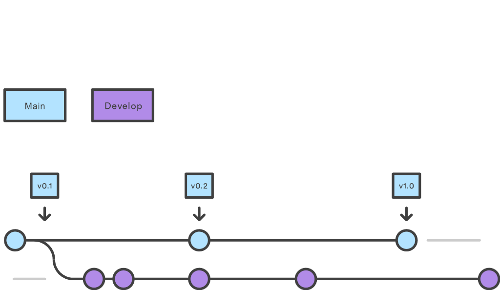
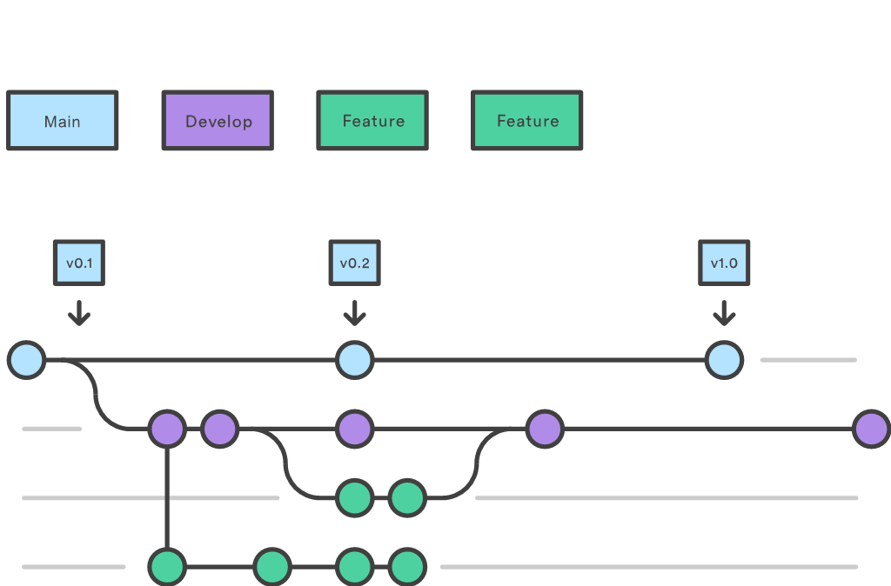
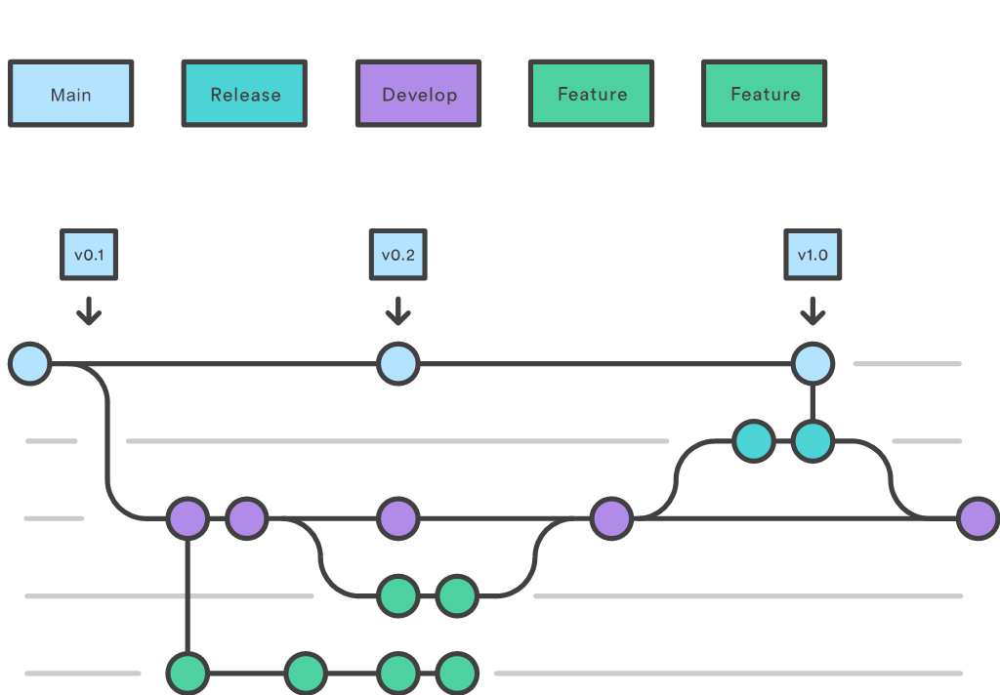
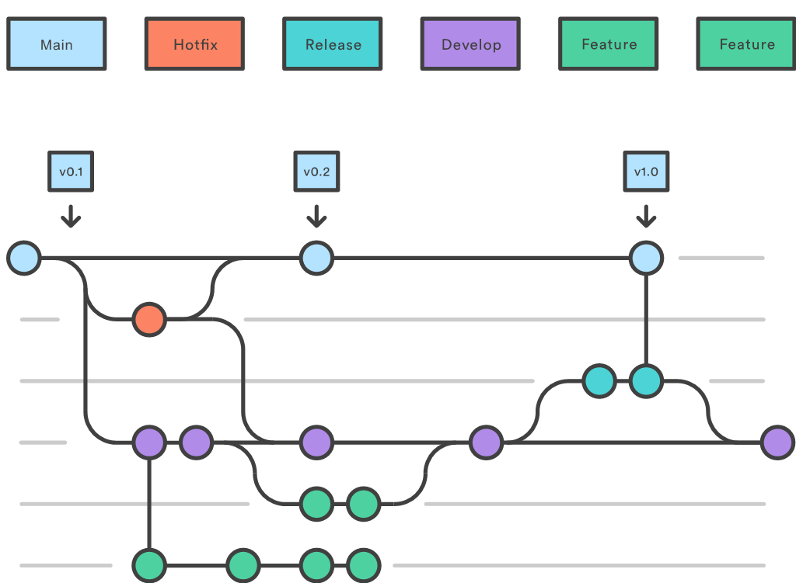

# Gitflow Branching Policy

## Overview

Gitflow is a legacy Git workflow that was originally a disruptive and novel strategy for managing Git branches. Although it has fallen in popularity in favor of trunk-based workflows, which are now considered best practices for modern continuous software development and DevOps practices, Gitflow can still be useful for projects with a scheduled release cycle. This document details Gitflow for historical purposes.

## What is Gitflow?

Gitflow is an alternative Git branching model that involves the use of feature branches and multiple primary branches. It was first published and made popular by Vincent Driessen at nvie. Compared to trunk-based development, Gitflow has numerous, longer-lived branches and larger commits. Under this model, developers create a feature branch and delay merging it to the main branch until the feature is complete. These long-lived feature branches require more collaboration to merge and have a higher risk of deviating from the main branch. They can also introduce conflicting updates.

Gitflow can be used for projects that have a scheduled release cycle and for the DevOps best practice of continuous delivery. This workflow doesn’t add any new concepts or commands beyond what’s required for the Feature Branch Workflow. Instead, it assigns very specific roles to different branches and defines how and when they should interact. In addition to feature branches, it uses individual branches for preparing, maintaining, and recording releases.

## Branches in Gitflow

### Develop and Main Branches

Instead of a single main branch, this workflow uses two branches to record the history of the project. The main branch stores the official release history, and the develop branch serves as an integration branch for features.

#### Diagram 1: Main and Develop Branches


### Feature Branches

Each new feature should reside in its own branch, which can be pushed to the central repository for backup/collaboration. Feature branches use develop as their parent branch. When a feature is complete, it gets merged back into develop. Features should never interact directly with main.

#### Diagram 2: Feature Branches


### Release Branches

Once develop has acquired enough features for a release (or a predetermined release date is approaching), you fork a release branch off of develop. Creating this branch starts the next release cycle, so no new features can be added after this point—only bug fixes, documentation generation, and other release-oriented tasks should go in this branch. Once it's ready to ship, the release branch gets merged into main and tagged with a version number. In addition, it should be merged back into develop.

#### Diagram 3: Release Branches


### Hotfix Branches

Maintenance or “hotfix” branches are used to quickly patch production releases. Hotfix branches are a lot like release branches and feature branches except they're based on main instead of develop. As soon as the fix is complete, it should be merged into both main and develop (or the current release branch), and main should be tagged with an updated version number.

#### Diagram 4: Hotfix Branches


## Gitflow Commands

### Creating and Managing Branches

- **Develop Branch**
  ```sh
  git branch develop
  git push -u origin develop
  ```

- **Feature Branch**
  ```sh
  git checkout develop
  git checkout -b feature_branch
  # or using git-flow
  git flow feature start feature_branch
  ```

- **Release Branch**
  ```sh
  git checkout develop
  git checkout -b release/0.1.0
  # or using git-flow
  git flow release start 0.1.0
  ```

- **Hotfix Branch**
  ```sh
  git checkout main
  git checkout -b hotfix_branch
  # or using git-flow
  git flow hotfix start hotfix_branch
  ```

## Notes on Gitflow vs Trunk-Based Development

- **Branch Longevity**: Gitflow often involves longer-lived branches compared to the short-lived branches in trunk-based development.
  - Note: Long-lived branches can introduce integration challenges and delays in merging.

- **Complexity**: Gitflow introduces more complexity with its multiple branches for features, releases, and hotfixes.
  - Note: This complexity requires more rigorous branch management and coordination.

- **Continuous Integration**: Trunk-based development encourages frequent integration, reducing the risk of integration conflicts.
  - Note: In Gitflow, delayed integration can lead to more complex merges and conflict resolution.

- **Release Management**: Gitflow is well-suited for projects with scheduled release cycles, while trunk-based development is better aligned with continuous deployment and continuous delivery practices.
  - Note: Adapting Gitflow for CI/CD can be challenging and may require additional tooling and processes.

## Summary

Here we discussed the Gitflow Workflow. Gitflow is one of many styles of Git workflows you and your team can utilize. Some key takeaways to know about Gitflow are:

- The workflow is great for a release-based software workflow.
- Gitflow offers a dedicated channel for hotfixes to production.

The overall flow of Gitflow is:

1. A develop branch is created from main.
2. A release branch is created from develop.
3. Feature branches are created from develop.
4. When a feature is complete, it is merged into the develop branch.
5. When the release branch is done, it is merged into develop and main.
6. If an issue in main is detected, a hotfix branch is created from main.
7. Once the hotfix is complete, it is merged into both develop and main.
