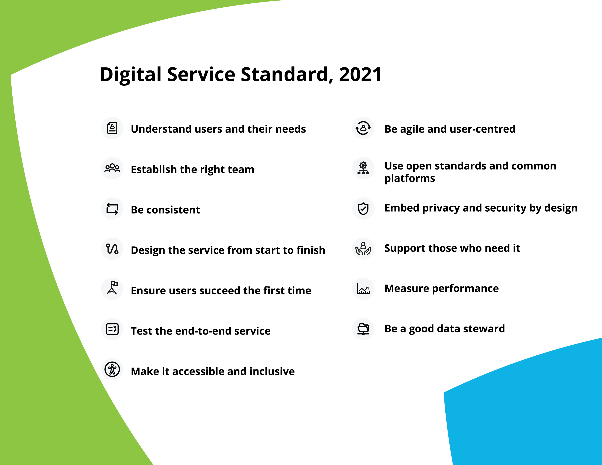

# Red Witch Design Control

We will comply with the Ontario [Digital and Data Directive](https://www.ontario.ca/page/ontarios-digital-and-data-directive-2021) by conforming to the [Digital Service Standard](https://www.ontario.ca/page/digital-service-standard) via adherence to the service design framework established in the [Service Design Playbook](https://www.ontario.ca/page/service-design-playbook).

Plan for design control as laid out in the DSS:

* SDLC has 4 phases: discovery, alpha, beta, live
* list the user groups, personas, needs, expectations
* plan and conduct user testing
* create usability report
* designate product manager
* continue service/maintenance after launch
* use consistent branding, leverage the [Ontario Design System](https://designsystem.ontario.ca/)
* perform device validation on all platforms
* create journey map of user experience
* include accessibility challenged user testers, leverage the [inclusive design cards](https://www.ontario.ca/page/inclusive-design-cards)
* include contact info / online help
* include usability testing in support plan (after launch)
* create plan for maintenance releases, outages, service monitoring
* include [WCAG success criteria](https://www.w3.org/TR/WCAG21/) in UI testing
* automate testing
* use [agile methodology](https://www.ontario.ca/page/being-agile-ontario-public-service)
* create quality plan for frequent iterations including rollbacks and security fixes
* create privacy and security report
* create processes for updating server software as well as client devices
* support must be sustainable and free to access
* employ web analytics for product surveillance
* evaluate user complaints from all sources
* calculate performance metrics
* create recovery plan for disasterous data loss
* create and publish useful and open data

---

## Ontario Digital and Data Directive, 2021 (excerpts)

### Application and Scope

This directive outlines requirements for ministries and provincial agencies for the design and delivery of digital services and for the proactive sharing of government data assets.

### Principles

The following principles support the requirements of this directive and are intended to guide ministries in interpreting and applying the directive.

* **Prioritization of user needs**: The needs of the user, determined through research and testing, are the first consideration in digital service delivery and the release of open data.
* **Transparency**: Government operates in a way that is easy for others to see what, why and how something is done.
* **Equitable access**: Access is equally available to all users.
* **Data informed**: The use of data is considered in decision-making.
* **Continuous improvement**: Government works in a way that demonstrates on-going, iterative improvement that is responsive to user need and supportive of the realization of benefit.

### Requirements

In order to support the government in achieving its objectives ministries and provincial agencies must address the following requirements.

### Digital Services

Ministry and provincial agency digital services, whether internally built or procured, must be designed, delivered and implemented according to [Ontario’s Digital Service Standard](https://www.ontario.ca/page/digital-service-standard#section-1) (DSS).

Ministry and provincial agency digital services must be:

* designed in a user-centred manner, address user needs and be supportive of the users’ journey from end to end as determined through active user research
* continuously evaluated and improved in an iterative manner
* made with technology that is scalable, interoperable, secure, accessible and open
* designed to take advantage of reusable technology and data where available
* designed in an iterative manner by a multi-disciplinary team that is empowered to prioritize incremental work and make decisions in the open whenever possible and designed to make the most effective use of data

### Digital Governance

All ministry digital services and all ministry IT projects in excess of $1M (whether built internally or procured) must:

* Be evaluated against the DSS through digital and IT governance processes (for example, Digital First Assessments, Architecture Review Board, or other governance processes as established)

Assessment against the DSS must occur at each phase in the digital service design cycle.

### Measurement

Ministry and provincial agency digital services must demonstrate their contributions to broader service or policy outcomes and establish evaluation and analytics approaches to support continuous improvement.  

At a minimum, all digital services must: 

* identify the service or policy outcomes to which the digital service is contributing and how the digital service will be evaluated throughout service design and post launch
* use service analytics to understand user behaviour across channels
* define performance metrics for the service up-front, early in the design process
* analyze performance and identify actionable data insights as early as possible
* monitor and report on the realization and sustainment of benefits as applicable

### Data

Ministries and provincial agencies must be fully transparent about their data assets and the ways in which they are acquired and used.

Ministry and provincial agency data assets are open by default unless exempted from release in limited and specific circumstances as set out below:

* Data that is subject to statutory confidentiality requirements, (for example, exempt from publication under the Freedom of Information and Protection of Privacy Act, 1990, the Personal Health Information Protection Act, 2004, the Anti-Racism Act, 2017 and/or other statutes).

* Data that should not be disclosed for legal, security, confidentiality, privacy or commercial sensitivity reasons as identified by expert assessors (for example, legal counsel, ITS security or privacy professional) as described in the [Open Data Guidebook](https://www.ontario.ca/document/open-data-guidebook-guide-open-data-directive-2015) (2015).

Directors closest to the data must ensure the appropriate expert assessment occurs prior to the publication of data and approve its release.

Ministries and provincial agencies ensure exempted data remains secure and is managed responsibly.

Open data must be accurate, timely, openly accessible, interpretable, coherent, de-identified, primary and released in accordance with the principles in the [International Open Data Charter](https://opendatacharter.net/principles/).

Ministries are required to consult and comply with the Open Data Guidebook. Provincial agencies should use the Open Data Guidebook as an example of best practices to adopt.

### Open Data Publication

All open data must be released in an open format.

Open data must be released at no charge to the user (for example, for-profit business, researcher or interested party etc.) and under the [Open Government Licence](https://www.ontario.ca/page/open-government-licence-ontario) – Ontario (See Appendix) and/or a similar open licence in consultation with users and on the advice of counsel.

No data assets released as open data are to be deleted or removed from public access except where it was published in error.

Ministry open data is to be published to the [Ontario Data Catalogue](https://data.ontario.ca/) in the language in which it was collected. The dataset title, description, and all accompanying supporting information must be available simultaneously in both English and French.

### Roles and Responsibilities

**Corporate Chief Information Officer**
* provide strategic leadership, advice and direction to ministries on technology to enable digital service delivery
* ensure that all data management platforms, applications and solutions acquired or built have open data features as a core function, in accordance with this directive
* embed digital and data policies, guidelines and standards across and into the IT organization

**Program Directors**
* ensure that a risk-based assessment process following the Open Data Guidebook is applied prior to the release of open data
* approve the release of open data as set out in this directive

### Definitions

**Governance**
Rules, systems and accountability structures that enable an organization to ensure that service development and delivery activities comply with all applicable regulations and legislation, optimize investments and risk, ensure the achievement of benefits and deliver on government mandate/priorities, while remaining mindful of user needs.

---

## Ontario Digital Service Standard, 2021 (excerpts)

The Digital Service Standard sets out 13 points to help Ontario ministries and agencies build and deliver simpler, faster, better government services and products for the people who live and do business in Ontario.

[Read case studies, resources and related rules](https://www.ontario.ca/page/build-ontario-government-services).

### Release in phases

Ontario’s service design journey follows design and release phases. Each phase is driven by user needs and prioritizes several points from the standard. Learn more about how to work in design and release phases in the [Service Design Playbook](https://www.ontario.ca/page/service-design-playbook).

* **Discovery**
Conducting user research to understand user needs

* **Alpha**
Testing our hypotheses with users using prototypes, models, examples or mock-ups

* **Beta**
Developing a minimum viable product or service that adds immediate value for users while the team develops and improves features.

* **Live**
Continuing to improve the service or product based on user feedback and data

### Laws and rules to follow

#### 3. Be consistent

* [Accessibility for Ontarians with Disabilities Act](https://www.ontario.ca/laws/regulation/r11191#BK9)
    * [Integrated Accessibility Standards Regulation](https://www.ontario.ca/laws/regulation/110191)
        * [Information and Communications Standards](https://www.ontario.ca/laws/regulation/110191#BK8)
* [French Language Services Act](https://www.ontario.ca/laws/statute/90f32), and [Government services in French](https://www.ontario.ca/page/government-services-french)
* [Ontario’s Digital and Data Directive](https://www.ontario.ca/page/ontarios-digital-and-data-directive-2021)
* [Ontario’s Public Service social media guidelines](https://www.ontario.ca/page/ontario-public-service-social-media-guidelines)

#### 7. Make it accessible and inclusive

* [Accessibility for Ontarians with Disabilities Act](https://www.ontario.ca/laws/statute/05a11)
    * [Integrated Accessibility Standards Regulation](https://www.ontario.ca/laws/regulation/110191)
        * [Customer Service Standards](https://www.ontario.ca/laws/regulation/110191#BK148)
        * [Information and Communications Standards](https://www.ontario.ca/laws/regulation/110191#BK8)
* [Ontario Human Rights Code](https://www.ontario.ca/laws/statute/90h19)
* [Ontarians with Disabilities Act](https://www.ontario.ca/laws/statute/01o32)
* [Ontario’s Inclusive Design Toolkit](https://www.ontario.ca/page/inclusive-design-toolkit)
* [Ontario’s Anti-Racism Act](https://www.ontario.ca/laws/statute/17a15)
* [Ontario’s Simpler, Faster, Better Services Act](https://www.ontario.ca/laws/statute/19s07)

#### 9. Use open standards and common platforms

* [Ontario’s Digital and Data Directive](https://www.ontario.ca/page/ontarios-digital-and-data-directive-2021)
* Open standards and common platforms, for example:
    * Web publishing on Ontario.ca (internal)
    * News in the Ontario Newsroom (internal)
    * [Ontario’s Data Catalogue](https://data.ontario.ca/)

#### 10. Embed privacy and security by design

* [Freedom of Information and Protection of Privacy Act](https://www.ontario.ca/laws/statute/90f31)
* [Archives and Recordkeeping Act](https://www.ontario.ca/laws/statute/06a34)
* [Personal Health Information Protection Act](https://www.ontario.ca/laws/statute/04p03)
* [Personal Information Protection and Electronic Documents Act](https://www.priv.gc.ca/en/privacy-topics/privacy-laws-in-canada/the-personal-information-protection-and-electronic-documents-act-pipeda/r_o_p/)
* [Canada’s Anti-Spam Legislation](http://fightspam.gc.ca/eic/site/030.nsf/eng/home)

#### 11. Support those who need it

* [Accessibility for Ontarians with Disabilities Act](https://www.ontario.ca/laws/statute/05a11)
    * [Integrated Accessibility Standards Regulation](https://www.ontario.ca/laws/regulation/110191)
        * [Information and Communications Standards](https://www.ontario.ca/laws/regulation/110191#BK8)

#### 13. Be a good data steward

* [Ontario’s Digital and Data Directive](https://www.ontario.ca/page/ontarios-digital-and-data-directive-2021)
* [Ontario’s Data Catalogue](https://data.ontario.ca/)
* Information, Privacy and Archives Directive (internal)

---

## Service design playbook (Excerpts)

This playbook is a crash course on service design. It works alongside the 13 points set out in the [Digital Service Standard](https://www.ontario.ca/page/digital-service-standard) to provide the basics needed to get started on a digital service.

[note to self: risk management?]

### Discovery phase

Discovery helps define a service’s potential users and how their needs can be met.

In discovery:

* conduct user research
* decide who the primary user groups will be
* learn about the people who will use the service
* ask users what they want in a service
* check if there are existing or non-governmental services that meet user needs
* identify policies and other barriers that will make meeting user needs difficult
* document the findings

It can be tempting to skip discovery and design a solution based on similar services or brainstorm potential options immediately. These are solution-oriented design processes, but service design is a user-oriented design process.

All services are different, but most projects need 4-8 weeks to for discovery.

### Alpha phase

While discovery is about research, alpha is about testing hypotheses and experimentation. The purpose of alpha is to determine how to meet the user needs that were identified in discovery. It’s an opportunity to quickly test many different approaches with users before building a service.

Alpha is fast-paced and may go in many unexpected directions before defining what the final solution could look like. Try new approaches to solving problems and test them quickly, so that potential issues can be found and fixed before investing too much time and money into one design.

In alpha:

* work directly with end users and stakeholders to co-create solutions
* build multiple prototypes of the service
* continuously test prototypes with users
* demonstrate that the service is technically and financially feasible
* estimate how much the service will cost
* identify existing processes or policies that will need to change to support the service

Alpha is a cyclical process of designing and testing potential solution options. Prototypes are built quickly, often together with users and stakeholders, and tested with real users. Feedback and testing results are used to improve the service. This process repeats itself until the prototype meets user needs and the first working version of the service is ready to be built. The first working version is called the minimum viable product. It will be built in the next phase, beta.

All services are different, but most teams will need 8-12 weeks to complete alpha.

### Beta phase

Beta is when the service finally comes to life. The goal of beta is to build a real service that works well for a larger group of people. The prototypes that were developed and tested during alpha are used to build a minimum viable product in a live, user-facing environment.

Build quickly and in small segments, taking the time to confirm that each segment of the service is on the right track. Launching a public service is the ultimate usability test, as it collects real data and user feedback. Feedback is used to refine the service, adding and adjusting features until the service is complete.

In beta:

* make a prioritized list of the user stories that have already been researched
* build a minimum viable product that can be used by the public in a live environment
* continuously test the service with users to collect feedback and discover helpful insights
* test the design for accessibility and use assistive devices like screen readers
* measure the service against key performance indicators
* release updates to patch and improve the service
* resolve any remaining technical or process-related challenges

All services are different. Most teams need at least 3-4 months to complete beta.

### Live phase

Live begins when the service has reached a point of maturity and all of the main features in the backlog have been built. While most people understand the purpose of live, it’s not always given the attention and resources it deserves.

Without proper resources devoted to live, services become quickly outdated and fail to meet both the Digital Service Standard and user needs.

Continuous improvement is one of the core principles of service design and that’s what live is all about. The goal is to continuously monitor, research, test and iterate for as long as the service is active.

In live:

* monitor and track the status of the service and key performance indicators
* conduct ongoing user research and usability testing every three to four months
* continue building features from the backlog and releasing improvements to the service
* communicate and celebrate the successes of the service
* ensure the service continues to meet the Digital Service Standard

### Team roles

Developing excellent digital services requires a variety of skills and abilities. The roles and number of people required will change depending on the needs of the project and the service design phase.

#### Portfolio managers

Responsible for the overall delivery and operation of the digital service.

Portfolio managers are experienced leaders with a strong understanding of the service and its users. They represent the service at all levels within their organization, working to make sure that it’s delivered successfully and meets both user needs and organizational priorities.

Portfolio managers are senior business executives (often directors) with the capacity to remove obstacles, champion the service at the most senior levels and assist in making sure that internal processes are focused on helping the service be successful. They need to be available to the team but not necessarily present with them at all times.

Involvement: Across all phases but not present 100% of the time

#### Product manager

Works with the team to create the vision for the service, and sets the day-to-day priorities to fulfil that vision and ensure the team delivers.

The product manager (or product owner) provides the vision for the service and sets the day-to-day priorities for the team. They need to have a good understanding of user needs, organizational goals and stakeholder priorities. Ultimately, the product manager has the decision-making authority to deliver on all aspects of the service. They are responsible for the development, operation and continual improvement of the service.

Involvement: Across all phases

#### Scrum master

Helps agile teams to deliver high-quality services, removes obstacles or blockers to progress and leads service meetings.

The scrum master (or delivery manager) helps to structure and facilitate the agile development process. Their role is to track progress and lead service meetings, including daily stand-ups, sprint planning sessions and retrospectives. The scrum master works with the team to make achievable commitments to the product manager and works with the product manager to remove obstacles to delivery.

Involvement: Across alpha and beta phases

#### User researchers

Help develop a deep understanding and empathy for the users and their needs so that the team can design the right service in the right way.

User researchers are responsible for building an understanding of the service’s users and their behaviour and providing insight to the broader team about how users interact with the service. They design, conduct and analyze the results of user research and usability testing to help give insights on how the service should be designed.

Involvement: Across all phases

#### Service designers

Design user-focused services and contributes to the development and continual improvement of service iterations.

Service designers leverage design practices to bridge the gap between research and final solutions. They are responsible for working with users and internal stakeholders to identify, prototype and test the service. They explore the various ways that a service can be delivered, looking for the solution that will best meet the needs of users and the broader organization.

Service designers are responsible for mapping the proposed solution across multiple delivery channels, such as web, call centres and correspondence. They help to identify the key elements of the minimum viable product to be built during beta.

Involvement: Across all phases

#### User experience designers

Responsible for designing a user-focused, consistent and accessible service by making use of established design patterns.

Designers create the user interface for the service, ensuring that it is designed to work across devices and browsers, meets web standards, is accessible and is able to be used by people regardless of their digital literacy.

They make use of existing design patterns and contribute to the design community to improve and add to future design patterns. They work closely with:

* the content writers to improve the usability of the service
* the service designers to conduct usability testing and design experiments
* the technical team members to develop and iterate prototypes with a view to continuously improving the service

Involvement: Across alpha, beta and live phases

#### Content writers

Ensure that content is simple, clear and written in plain language so that users receive the information that they need and understand what the government requires of them.

Content writers create content that will help users understand what they need to know and do. They review content to make sure it’s accurate, relevant and follows style guide standards.

Content writers work closely with subject matter experts, user experience designers and service designers to continuously improve written copy. Content writers also work with the government’s overall content community to develop a common style and lexicon that is clear, approachable and consistent across multiple platforms.

Involvement: Across alpha and beta phases

#### Technology lead

Works with the team to decide on technical requirements and improvements for software development and help solve any technical problems that may arise.

The technology lead is the most senior technical person on the team. Their role is to:

* select the technology products best suited to support the service
* direct the technical build and all supporting technical staff
* provide coaching and feedback to other technical team members
* identify technical options and inform architectural approaches
* make sure that any new or updated platforms, services, transactions and architecture are robust, scalable, open and secure

Involvement: Across all phases

#### Developers

Build quality, well-tested software and services according to standards and best practices.

Developers write, adapt, maintain and support well-tested code to help build services that meet the needs of users.

Some developers will specialize in front end or back end development, but most will have solid skills in both. A good team has a mix of both front end and back end skills. As they work, they’re expected to keep security, accessibility and open standards in mind. Developers help solve technical problems when needed.

Involvement: Across alpha, beta and live phases

#### DevOps engineers

Design, implement and run the production systems, help the team deploy features quickly and reliably and ensure the service runs smoothly.

DevOps engineers are responsible for keeping services online and establishing effective deployment and testing pipelines.

They work closely with developers to make sure that all technology is built with consideration to how it will be operated, and puts the foundations in place for the service to be hosted and deployed.

DevOps engineers have expertise in technical infrastructure, configuration management, monitoring, deployment and operating systems. Developers and DevOps engineers are expected to share responsibility when supporting the service outside of normal hours.

Involvement: Across alpha, beta and live phases but not present 100% of the time

#### Performance analyst

Helps the team understand user behaviour and measure success by providing quantitative and qualitative evidence from web analytics and user feedback.

The digital performance analyst defines, collects and presents key performance data from the service. They support portfolio and product managers by generating new and useful information and translating it into recommendations that will improve the service for users. The performance analyst makes sure that the service meets all key performance indicators.

Involvement: Across beta and live phases but not present 100% of the time

#### Subject matter experts

Provide high-level knowledge and in-depth expertise about a particular subject matter area.

Subject matter experts vary widely depending on the type and scope of the project. They are collectively responsible for providing expert business knowledge of how the service or organization currently functions. Examples of subject matter experts include policy advisors, lawyers, privacy experts, front-line staff and call centre workers.

Involvement: Across all phases but not present 100% of the time

---

## Applicable Standards

* Ontario’s Digital and Data Directive, 2021
* Governance and Management of IT Directive, 2021
* Governance and Management of Information Assets Directive, 2021
* Simpler, Faster, Better Services Act, 2019
* Archives and Recordkeeping Act, 2006
* Freedom of Information and Protection of Privacy Act, 1990
* Personal Health Information Protection Act, 2004
* Anti-Racism Act, 2017  
* French Language Services Act, 1990
* Accessibility for Ontarians with Disabilities Act, 2005
