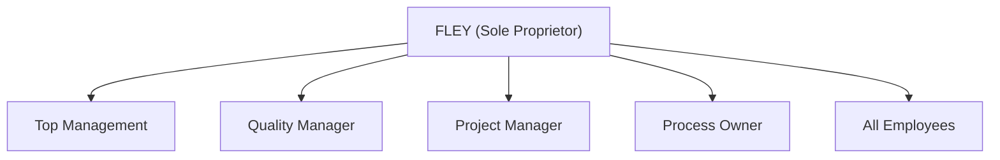

# **Organizational Chart**

---

## Overview

Floating Eye Software (FLEY) is a **sole proprietorship**, managed and operated by one individual who fulfills all organizational roles defined in the Quality Management System (QMS).

This structure ensures that **roles, responsibilities, and authorities** are clearly defined and implemented in compliance with ISO 9001:2015 — Clause 5.3.

---

## Roles, Responsibilities, and Authorities

**Top Management**

* Provides strategic direction and ensures alignment with FLEY’s purpose and values.
* Establishes, implements, and maintains the Quality Policy.
* Approves quality objectives and management review outcomes.
* Ensures resources are available to achieve objectives.
* Promotes customer focus and continual improvement.

**Quality Manager**

* Establishes, implements, and maintains the QMS.
* Ensures processes are compliant with applicable requirements.
* Reports on QMS performance and opportunities for improvement.
* Maintains the risk and opportunity register.
* Oversees document and change control.

**Project Manager**

* Prepares project plans and manages scope, schedule, and resources.
* Tracks progress, risks, and deliverables.
* Coordinates project reviews and status reporting.
* Ensures projects align with quality and strategic objectives.

**Process Owner**

* Oversees operational and support processes.
* Identifies and manages risks and opportunities.
* Ensures outputs are identified, traceable, and properly documented.
* Includes ownership of process-specific areas such as Project Management and Design & Development Control.

**All Employees**

* Comply with approved procedures and documented information.
* Report changes, issues, or risks as they arise.
* Participate in continual improvement activities.

---

## Responsibility Statement

All of the above functional roles are performed by **the same individual** — the sole proprietor of FLEY.
This integrated structure ensures clear accountability, consistent decision-making, and effective management of the Quality Management System.
