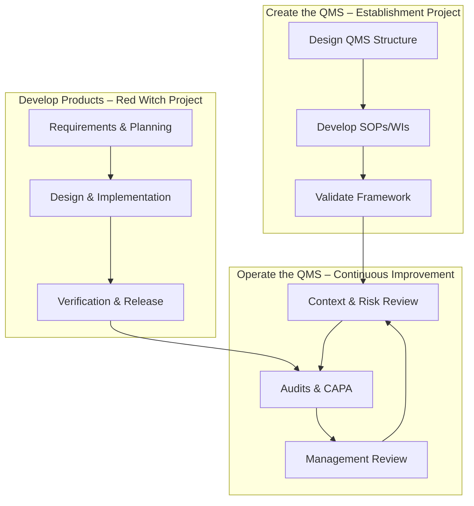

# **Process Map – FLEY QMS**

## **1. QMS Structure Overview**

This diagram shows the **hierarchical structure of the FLEY Quality Management System**, from foundational documents through SOPs to operational implementation.

```mermaid
flowchart TD
    %% Core Definition Layer
    subgraph Core[Core Definition Layer]
        QM[Quality Manual]
        CA[Context Analysis]
        QP[Quality Policy]
        PM[Process Map]
        OC[Organizational Chart]
    end

    %% SOP Layer
    subgraph SOP[SOP Layer]
        SOP3[Document & Record Control SOP<br/>(QMS-SOP-03)]
        SOP4[Change Control SOP<br/>(QMS-SOP-04)]
        SOP5[Leadership SOP<br/>(QMS-SOP-05)]
        SOP6[Quality Planning SOP<br/>(QMS-SOP-06)]
        SOP7[Project Management SOP<br/>(QMS-SOP-07)]
        SOP8[Risk & Opportunity SOP<br/>(QMS-SOP-08)]
        SOP9[Design & Development SOP<br/>(QMS-SOP-09)]
    end

    %% Operational Layer
    subgraph WI[Operational Layer]
        WISetup[WI-QMS-10-02: Set Up QMS in GitHub]
        WIOperate[WI-QMS-09-01: Operate QMS in GitHub]
        ProductBoards[Red Witch Project Boards]
    end

    %% Connections
    QM --> SOP3
    QM --> SOP4
    QM --> SOP5
    QM --> SOP6
    QM --> SOP7
    QM --> SOP8
    QM --> SOP9

    CA --> SOP6
    PM --> SOP7
    PM --> SOP9
    OC --> SOP5
    OC --> SOP7

    SOP3 --> WISetup
    SOP4 --> WISetup
    SOP5 --> WIOperate
    SOP6 --> WIOperate
    SOP7 --> WIOperate
    SOP8 --> WIOperate
    SOP9 --> WIOperate

    WISetup --> WIOperate
    WIOperate --> ProductBoards
```

**Explanation:**

1. **Core Definition Layer:** Establishes the QMS scope, policies, context, and organizational structure.
2. **SOP Layer:** Standard Operating Procedures define **how activities are controlled**.
3. **Operational Layer:** Work Instructions implement the QMS in GitHub and manage **all product/project workflows**.

The diagram shows the **flow from definition → procedures → execution**, ensuring **traceability, control, and continual improvement**.

---

## **2. QMS Operational Workflow**

The following diagram illustrates how the three main workflows interact dynamically within the FLEY QMS:



**Workflow Summary:**

1. **Operate the QMS:**

   * Monitor context, risks, and opportunities
   * Conduct audits, CAPA, and management reviews
   * Feed outcomes into improvements and updates

2. **Create the QMS:**

   * Design and document QMS structure
   * Develop SOPs and Work Instructions
   * Validate framework for approval

3. **Develop Products (Red Witch):**

   * Collect requirements and plan
   * Execute design, implementation, and verification
   * Release product outputs while feeding insights into QMS operation

---

## **3. Process Interactions Table**

| Process               | Inputs                       | Outputs                      | Responsible Roles     | Key Controls               | Intended Result       |
| --------------------- | ---------------------------- | ---------------------------- | --------------------- | -------------------------- | --------------------- |
| **Operate the QMS**   | Context, risks, audits       | Updated objectives & actions | Top Management        | Risk register, Mgmt Review | Continual improvement |
| **Create the QMS**    | ISO requirements, org needs  | Approved manual, SOPs & WIs  | Quality Manager       | Planning SOP               | Validated framework   |
| **Develop Products**  | Quality plans & requirements | Verified releases            | Project Manager / Dev | Design SOP                 | Compliant product     |
| **Support Processes** | Docs / records               | Controlled information       | Quality Manager       | GitHub control rules       | Traceable records     |

---

## **4. References**

* `Quality-Manual.md` – overview
* `Context-Analysis.md` – internal/external issues
* `Quality-Policy.md` – top-level commitments
* `SOPs/` – operational procedures
* `WIs/` – Work Instructions and records
* `records/` – objective evidence
