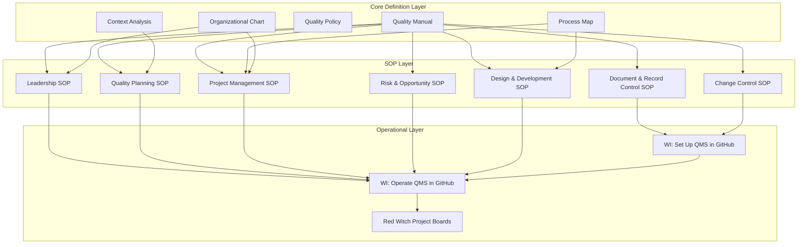
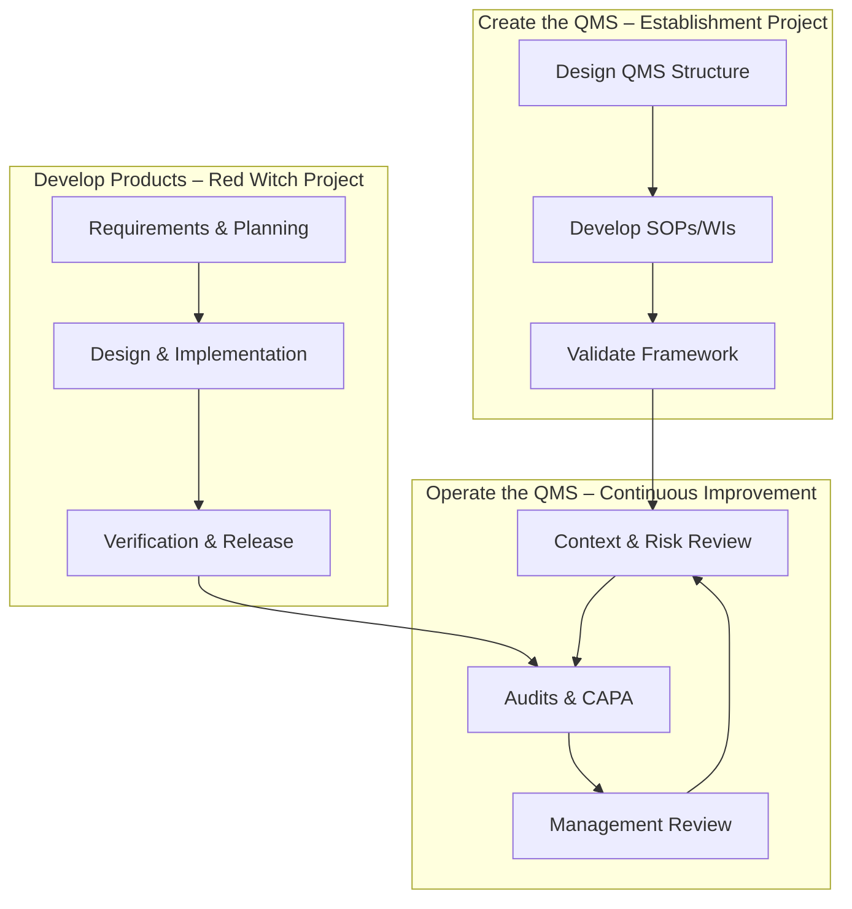

# **Process Map – FLEY QMS**

## **1. QMS Structure Overview**

This diagram shows the **hierarchical structure of the FLEY Quality Management System**, from foundational documents through SOPs to operational implementation.

**Explanation:**

1. **Core Definition Layer:** Establishes the QMS scope, policies, context, and organizational structure.
2. **SOP Layer:** Standard Operating Procedures define **how activities are controlled**.
3. **Operational Layer:** Work Instructions implement the QMS in GitHub and manage **all product/project workflows**.

The diagram shows the **flow from definition → procedures → execution**, ensuring **traceability, control, and continual improvement**.

---

## **2. QMS Operational Workflow**

The following diagram illustrates how the three main workflows interact dynamically within the FLEY QMS:

**Workflow Summary:**

1. **Operate the QMS:**

   * Monitor context, risks, and opportunities
   * Conduct audits, CAPA, and management reviews
   * Feed outcomes into improvements and updates

2. **Create the QMS:**

   * Design and document QMS structure
   * Develop SOPs and Work Instructions
   * Validate framework for approval

3. **Develop Products (Red Witch):**

   * Collect requirements and plan
   * Execute design, implementation, and verification
   * Release product outputs while feeding insights into QMS operation

---

## **3. Process Interactions Table**

| Process               | Inputs                       | Outputs                      | Responsible Roles     | Key Controls               | Intended Result       |
| --------------------- | ---------------------------- | ---------------------------- | --------------------- | -------------------------- | --------------------- |
| **Operate the QMS**   | Context, risks, audits       | Updated objectives & actions | Top Management        | Risk register, Mgmt Review | Continual improvement |
| **Create the QMS**    | ISO requirements, org needs  | Approved manual, SOPs & WIs  | Quality Manager       | Planning SOP               | Validated framework   |
| **Develop Products**  | Quality plans & requirements | Verified releases            | Project Manager / Dev | Design SOP                 | Compliant product     |
| **Support Processes** | Docs / records               | Controlled information       | Quality Manager       | GitHub control rules       | Traceable records     |

---

| **Process / SOP**                   | **Purpose / Description**                                                            | **Key Inputs**                                 | **Key Outputs**                                             | **Main Risks / Opportunities**                             | **Performance Criteria / Metrics**          | **Linked SOPs / WIs**                                            |
| ----------------------------------- | ------------------------------------------------------------------------------------ | ---------------------------------------------- | ----------------------------------------------------------- | ---------------------------------------------------------- | ------------------------------------------- | ---------------------------------------------------------------- |
| **Operate the QMS**                 | Maintain and improve the effectiveness of the QMS through audits, reviews, and CAPA. | Context analysis, risk register, audit results | Updated objectives, CAPA actions, management review outputs | Risk of ineffective CAPA, missed improvement opportunities | % CAPA closed on time, audit findings trend | SOP – Leadership, SOP – Risk & Opportunity, SOP – Change Control |
| **Create the QMS**                  | Establish and maintain QMS structure, documentation, and governance.                 | ISO 9001 requirements, organizational needs    | Approved Quality Manual, SOPs, WIs                          | Scope gaps, over-documentation, misalignment with ISO      | % documents validated, time to approval     | SOP – Quality Planning, WI – Setup QMS in GitHub                 |
| **Develop Products (Red Witch)**    | Plan, design, verify, and release products compliant with QMS.                       | Requirements, quality plans                    | Verified releases, product records                          | Missed requirements, design errors, uncontrolled releases  | % requirements verified, defect rate        | SOP – Design & Development, WI – Operate QMS in GitHub           |
| **Support Processes**               | Control documents, records, and configuration in GitHub.                             | SOP/WI drafts, forms                           | Controlled and traceable records                            | Unauthorized edits, loss of control                        | Audit compliance, version accuracy          | SOP – Document & Record Control, WI – Operate QMS in GitHub      |
| **SOP – Document & Record Control** | Define how documents and records are created, reviewed, approved, and maintained.    | Draft documents, templates                     | Approved, version-controlled docs                           | Uncontrolled documents, outdated information               | 100 % docs versioned in Git                 | WI – GitHub Setup, WI – Operate QMS                              |
| **SOP – Change Control**            | Manage changes to QMS and project artifacts.                                         | Change requests, issues                        | Approved PRs, updated docs                                  | Unreviewed changes, lost traceability                      | % changes reviewed / approved               | WI – GitHub PR Workflow                                          |
| **SOP – Leadership**                | Ensure leadership commitment and communication.                                      | Org. context, policy inputs                    | Quality objectives, mgmt review outputs                     | Weak commitment, unclear direction                         | Completion of management reviews            | N/A                                                              |
| **SOP – Quality Planning**          | Translate policy into actionable quality objectives and plans.                       | Policy, risks, context analysis                | Quality plans, objectives                                   | Unrealistic objectives, lack of alignment                  | % objectives achieved                       | WI – Plan Quality Objectives                                     |
| **SOP – Project Management**        | Control project execution under QMS.                                                 | Requirements, resources                        | Project deliverables, reports                               | Schedule delays, unclear scope                             | On-time delivery %, milestone tracking      | WI – Red Witch Boards                                            |
| **SOP – Risk & Opportunity**        | Identify and manage risks and opportunities.                                         | Context, process feedback                      | Updated risk register                                       | Unidentified risks, over-control                           | Risk review completion rate                 | WI – Update Risk Register                                        |
| **SOP – Design & Development**      | Define product design and verification methodology.                                  | Requirements, design inputs                    | Verified design, release package                            | Design errors, missing verification                        | Verification / validation success rate      | WI – Product Dev Process                                         |

---

## **4. References**

* `Quality-Manual.md` – overview
* `Context-Analysis.md` – internal/external issues
* `Quality-Policy.md` – top-level commitments
* `SOPs/` – operational procedures
* `WIs/` – Work Instructions and records
* `records/` – objective evidence
