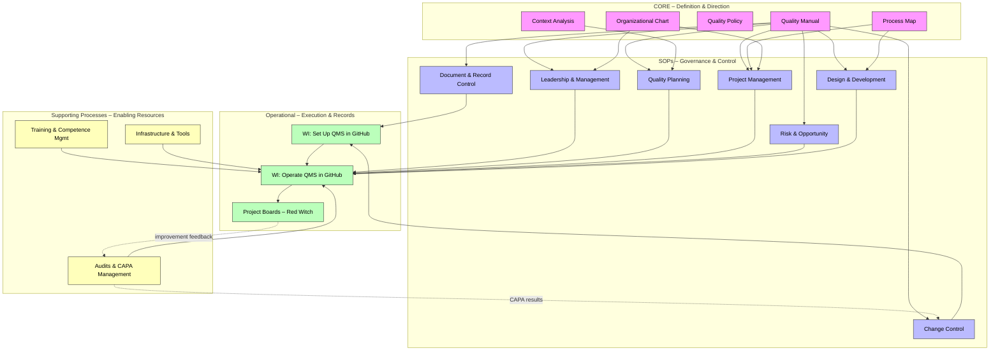
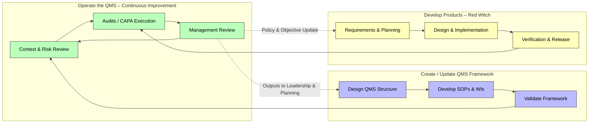

# **QMS – FLEY Process Map**

**Slug:** Process-Map  
**Revision:** r1  
**Effective Date:** [YYYY-MM-DD]  
**Controlled Source:** https://github.com/mlehotay/redwitch/wiki/Process-Map  

---

## **1. QMS Structure Overview**

This diagram shows the **hierarchical structure of the FLEY Quality Management System**, from foundational documents through SOPs to operational implementation.

**Explanation:**

1. **Core Definition Layer:** Establishes the QMS scope, policies, context, and organizational structure.
2. **SOP Layer:** Standard Operating Procedures define **how activities are controlled**.
3. **Operational Layer:** Work Instructions implement the QMS in GitHub and manage **all product/project workflows**.

The diagram shows the **flow from definition → procedures → execution**, ensuring **traceability, control, and continual improvement**.

---

## **2. QMS Operational Workflow**

The following diagram illustrates how the three main workflows interact dynamically within the FLEY QMS:

**Workflow Summary:**

1. **Operate the QMS:**

   * Monitor context, risks, and opportunities
   * Conduct audits, CAPA, and management reviews
   * Feed outcomes into improvements and updates

2. **Create the QMS:**

   * Design and document QMS structure
   * Develop SOPs and Work Instructions
   * Validate framework for approval

3. **Develop Products (Red Witch):**

   * Collect requirements and plan
   * Execute design, implementation, and verification
   * Release product outputs while feeding insights into QMS operation

---

## **3. QMS Process Table**

| Process                           | Inputs                                 | Outputs                                 | Resources                                                   | Responsible Roles                 | Risks & Opportunities                                                    | Monitoring & Control                                       | Documented Information / Retention                                                                 |
| --------------------------------- | -------------------------------------- | --------------------------------------- | ----------------------------------------------------------- | --------------------------------- | ------------------------------------------------------------------------ | ---------------------------------------------------------- | -------------------------------------------------------------------------------------------------- |
| **Operate the QMS**               | Context, risks, audits, feedback       | Updated objectives & actions            | Risk register, audit checklist, management review templates | Top Management, Quality Manager   | Ineffective CAPA, missed improvements / Proactive improvements           | Audit schedule, CAPA closure tracking, Mgmt review minutes | SOPs: Leadership, Risk & Opportunity, Change Control; WI: Operate QMS; Retain in GitHub / records/ |
| **Create the QMS**                | ISO requirements, organizational needs | Approved Quality Manual, SOPs & WIs     | Documentation tools, SME inputs                             | Quality Manager, SMEs             | Scope gaps, misalignment with ISO / Efficient QMS implementation         | Document review & approval process, validation checklist   | SOP: Quality Planning; WI: Setup QMS; Quality-Manual.md; Retain in GitHub                          |
| **Develop Products (Red Witch)**  | Requirements, quality plans            | Verified releases                       | Design software, project boards, testing facilities         | Project Manager, Development Team | Missed requirements, design errors / Early validation, design automation | Verification & validation reviews, milestone checks        | SOP: Design & Development; WI: Operate QMS, Product Dev; Product records in GitHub                 |
| **Document & Record Control**     | Draft docs, templates                  | Approved, version-controlled docs       | Document management system, GitHub                          | Quality Manager                   | Unauthorized edits, outdated docs / Controlled documentation             | Review & approval workflow, version check                  | SOP: Document & Record Control; WI: GitHub Setup; Retain in GitHub                                 |
| **Change Control**                | Change requests, issues                | Approved PRs, updated docs              | GitHub, change log                                          | Quality Manager, Project Lead     | Unreviewed changes / Controlled updates                                  | PR review workflow, approval check                         | SOP: Change Control; WI: GitHub PR Workflow; Retain in GitHub                                      |
| **Leadership / Management**       | Org. context, policy inputs            | Quality objectives, Mgmt review outputs | Meeting templates, dashboards                               | Top Management                    | Weak commitment, unclear direction / Improved engagement                 | Completion of management reviews, action tracking          | SOP: Leadership; Meeting minutes in GitHub                                                         |
| **Risk & Opportunity Management** | Context, process feedback              | Updated risk register                   | Risk register tool                                          | Quality Manager, Process Owners   | Unidentified risks, over-control / Risk mitigation, opportunity capture  | Risk review schedule, update log                           | SOP: Risk & Opportunity; WI: Update Risk Register; Retain in GitHub                                |
| **Project Management**            | Requirements, resources                | Project deliverables, reports           | Project boards, scheduling tools                            | Project Manager                   | Schedule delays, unclear scope / Efficient execution                     | Milestone tracking, progress reporting                     | SOP: Project Management; WI: Red Witch Boards; Retain in GitHub                                    |
| **Quality Planning**              | Policy, risks, context                 | Quality plans, objectives               | Templates, planning tools                                   | Quality Manager                   | Unrealistic objectives / Alignment with ISO                              | Objective tracking, review of plans                        | SOP: Quality Planning; WI: Plan Quality Objectives; Retain in GitHub                               |
| **Training Management**           | Training needs                         | Trained personnel                       | Learning platform, training materials                       | HR / Quality Manager              | Skills gaps / Competency improvement                                     | Training completion records, competency checks             | Training records in GitHub                                                                         |
