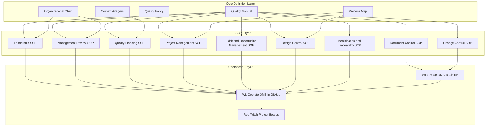
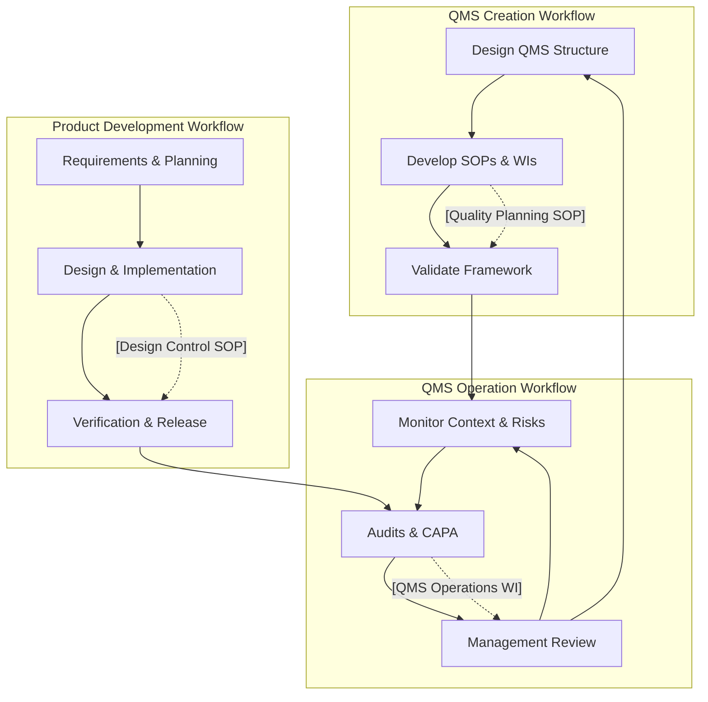

# **QMS – FLEY Process Map**

**Slug:** Process-Map  
**Revision:** r1  
**Effective Date:** [YYYY-MM-DD]  
**Controlled Source:** https://github.com/mlehotay/redwitch/wiki/Process-Map  

---

## **1. QMS Structure Overview**

This diagram shows the **hierarchical structure of the FLEY Quality Management System**, from foundational documents through SOPs to operational implementation.

**Explanation:**

1. **Core Definition Layer:** Establishes the QMS scope, policies, context, and organizational structure.
2. **SOP Layer:** Standard Operating Procedures define **how activities are controlled**.
3. **Operational Layer:** Work Instructions implement the QMS in GitHub and manage **all product/project workflows**.

The diagram shows the **flow from definition → procedures → execution**, ensuring **traceability, control, and continual improvement**.

---

## **2. QMS Operational Workflow**

The following diagram illustrates the three primary workflows defined in the Quality Manual (§5. QMS Workflows).

Each workflow corresponds to a set of Standard Operating Procedures (SOPs) and Work Instructions that define how FLEY’s QMS is created, operated, and applied in product development.

Feedback loops between workflows support continual improvement in alignment with ISO 9001:2015 + Amd 1:2024.

**Workflow Summary:**

1. **Operate the QMS:**

   * Monitor context, risks, and opportunities
   * Conduct audits, CAPA, and management reviews
   * Feed outcomes into improvements and updates

2. **Create the QMS:**

   * Design and document QMS structure
   * Develop SOPs and Work Instructions
   * Validate framework for approval

3. **Develop Products (Red Witch):**

   * Collect requirements and plan
   * Execute design, implementation, and verification
   * Release product outputs while feeding insights into QMS operation

---

## **3. QMS Process Table**

| Process                           | Inputs                                 | Outputs                               | Resources                       | Responsible Roles               |
| --------------------------------- | -------------------------------------- | ------------------------------------- | ------------------------------- | ------------------------------- |
| **Operate the QMS**               | Context, risks, audits, feedback       | Updated objectives & actions          | Risk register, audit checklist  | Top Management, Quality Manager |
| **Create the QMS**                | ISO requirements, organizational needs | Approved QMS framework, SOPs & WIs    | Documentation tools, SME inputs | Quality Manager, SMEs           |
| **Develop Products (Red Witch)**  | Requirements, quality plans            | Verified releases                     | Design tools, project boards    | Project Manager, Dev Team       |
| **Document & Record Control**     | Draft docs, templates                  | Approved, version-controlled docs     | GitHub, templates               | Quality Manager                 |
| **Change Control**                | Change requests, issues                | Approved changes, updated documents   | GitHub, change log              | Project Lead, Quality Manager   |
| **Leadership / Management**       | Policy inputs, context                 | Objectives, management review outputs | Dashboards, meeting templates   | Top Management                  |
| **Risk & Opportunity Management** | Context, feedback                      | Updated risk register                 | Risk register tool              | Quality Manager, Process Owners |
| **Project Management**            | Requirements, resources                | Project deliverables                  | Scheduling tools, boards        | Project Manager                 |
| **Quality Planning**              | Policy, risks, context                 | Quality plans, objectives             | Planning tools                  | Quality Manager                 |
