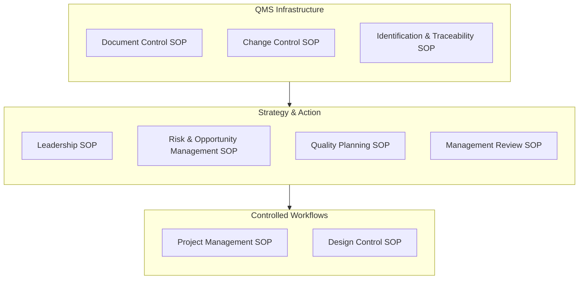
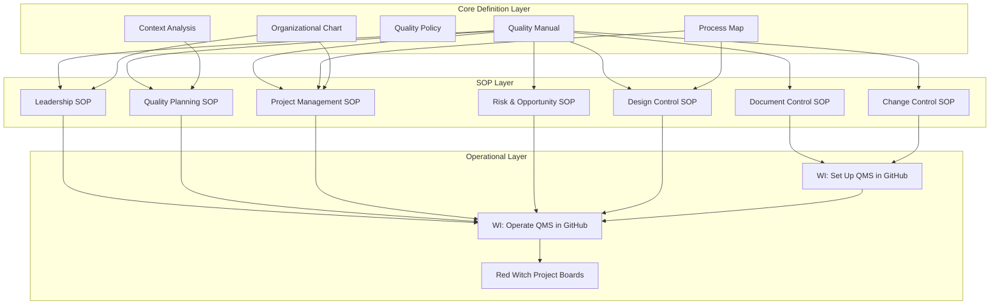
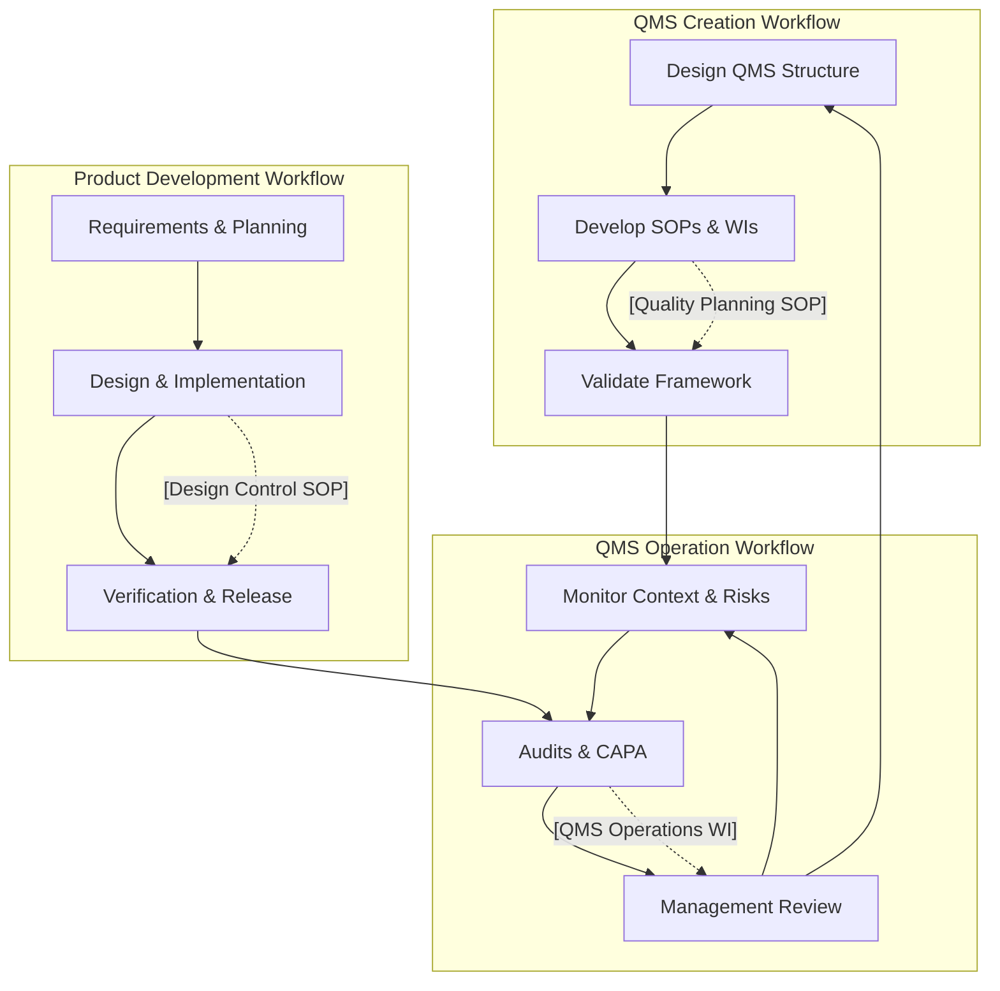

# **QMS – FLEY Process Map**

**Slug:** Process-Map  
**Revision:** r1  
**Effective Date:** [YYYY-MM-DD]  
**Controlled Source:** https://github.com/mlehotay/fley-qms/blob/main/QMS/Process-Map.md  

---

## **1. QMS Process Framework**

The following diagram illustrates how FLEY’s **Standard Operating Procedures (SOPs)** are organized into three conceptual groups.
These groups represent the **foundation, direction, and execution** of the Quality Management System (QMS):

* **QMS Infrastructure** – foundational control and traceability systems
* **Strategy & Action** – leadership, planning, and improvement functions
* **Controlled Workflows** – execution and delivery of product activities

Each group interacts with the others in a logical top-down sequence:
Infrastructure supports Strategy, Strategy directs Controlled Work, and Controlled Work feeds results and records back into Infrastructure.

**Interpretation:**
This diagram shows the logical flow of control within the QMS.
Foundational **Infrastructure SOPs** establish document and change control systems; these enable and support **Strategy & Action SOPs**, which define direction, risks, and improvement activities.
Finally, **Controlled Workflows** execute the actual product and project work under those established controls.
Together, these three groups ensure the QMS remains consistent, effective, and continually improvable.

---

## **2. QMS Document Structure**

This diagram shows the **hierarchical structure of the FLEY Quality Management System**, from foundational documents through SOPs to operational implementation.

**Explanation:**

1. **Core Definition Layer:** Establishes the QMS scope, policies, context, and organizational structure.
2. **SOP Layer:** Standard Operating Procedures define **how activities are controlled**.
3. **Operational Layer:** Work Instructions implement the QMS in GitHub and manage **all product/project workflows**.

The diagram shows the **flow from definition → procedures → execution**, ensuring **traceability, control, and continual improvement**.

---

## **3. QMS Workflow Interactions**

The following diagram illustrates the three primary workflows defined in the Quality Manual (§5. QMS Workflows).

Each workflow corresponds to a set of Standard Operating Procedures (SOPs) and Work Instructions that define how FLEY’s QMS is created, operated, and applied in product development.

Feedback loops between workflows support continual improvement in alignment with ISO 9001:2015 + Amd 1:2024.

**Workflow Summary:**

1. **Operate the QMS:**

   * Monitor context, risks, and opportunities
   * Conduct audits, CAPA, and management reviews
   * Feed outcomes into improvements and updates

2. **Create the QMS:**

   * Design and document QMS structure
   * Develop SOPs and Work Instructions
   * Validate framework for approval

3. **Develop Products (Red Witch):**

   * Collect requirements and plan
   * Execute design, implementation, and verification
   * Release product outputs while feeding insights into QMS operation

---

## **4. QMS Process Summary Tables**

### **4.1 QMS Workflows Overview**

| **Workflow**                     | **Inputs**                             | **Outputs**                           | **Resources**                   | **Responsible Roles**           |
| -------------------------------- | -------------------------------------- | ------------------------------------- | ------------------------------- | ------------------------------- |
| **Operate the QMS**              | Context, risks, audits, feedback       | Updated objectives & actions          | Risk register, audit checklist  | Top Management, Quality Manager |
| **Create the QMS**               | ISO requirements, organizational needs | Approved QMS framework, SOPs & WIs    | Documentation tools, SME inputs | Quality Manager, SMEs           |
| **Develop Products (Red Witch)** | Requirements, quality plans            | Verified and released product outputs | Design tools, project boards    | Project Manager, Dev Team       |

*These three workflows represent the primary operational cycles of the FLEY Quality Management System and define how the system is created, maintained, and applied.*

---

### **4.2 SOP Process Summary**

| **SOP Group**            | **Process / SOP**                     | **Inputs**                                | **Outputs**                                | **Resources**                    | **Responsible Roles**           |
| ------------------------ | ------------------------------------- | ----------------------------------------- | ------------------------------------------ | -------------------------------- | ------------------------------- |
| **QMS Infrastructure**   | **Document Control SOP**              | Draft documents, templates                | Approved, version-controlled documents     | GitHub, templates                | Quality Manager                 |
|                          | **Change Control SOP**                | Change requests, issues                   | Approved changes, updated documentation    | GitHub, change log               | Project Lead, Quality Manager   |
|                          | **Identification & Traceability SOP** | Work records, component IDs               | Traceable records and configurations       | Tracking tools, GitHub issues    | Quality Manager, Project Team   |
| **Strategy & Action**    | **Leadership SOP**                    | Policy inputs, context                    | Objectives, quality direction              | Dashboards, meeting templates    | Top Management                  |
|                          | **Risk & Opportunity Management SOP** | Context, audit feedback, performance data | Updated risk register and mitigation plans | Risk register, assessment tools  | Quality Manager, Process Owners |
|                          | **Quality Planning SOP**              | Policy, risks, context                    | Quality objectives, quality plans          | Planning tools                   | Quality Manager                 |
|                          | **Management Review SOP**             | Audit results, performance data, risks    | Management review minutes & action items   | Review templates, reports        | Top Management, Quality Manager |
| **Controlled Workflows** | **Project Management SOP**            | Requirements, resources                   | Project deliverables, performance records  | Scheduling tools, project boards | Project Manager                 |
|                          | **Design Control SOP**                | Requirements, specifications              | Verified and validated design outputs      | Design tools, test plans         | Project Manager, Dev Team       |

*This table summarizes the nine SOPs that implement the QMS.
Each SOP transforms controlled inputs into verified outputs, ensuring consistency, traceability, and continual improvement across all QMS processes.*
