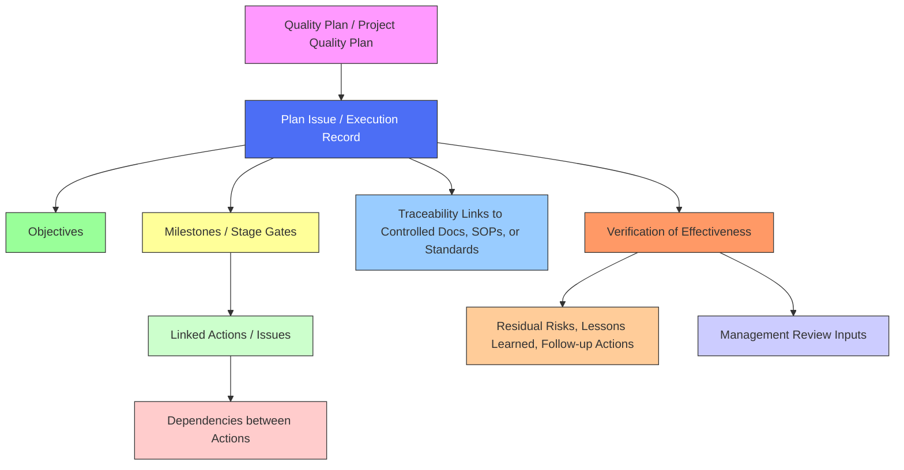

# **Overview of the FLEY Planning Process**

The FLEY Planning Process defines how the organization plans, coordinates, and verifies quality-related activities across projects, programs, and organizational initiatives. It ensures traceability, structured execution, and alignment with ISO 9001:2015 planning and management requirements.

* **Controlled Quality Plan (Document Control):** The formal plan, optional for smaller initiatives.
* **Plan Issue / Execution Record:** The GitHub (or project tracking tool) record that coordinates the work.
* **Objectives:** The measurable goals defined in the plan.
* **Milestones / Stage Gates:** Checkpoints grouping work or phases.
* **Linked Actions / Issues:** Tasks or activities tied to the milestones.
* **Dependencies:** Defines sequencing and blocking relationships between actions.
* **Traceability Links:** Connects to relevant SOPs, documents, or standards.
* **Verification of Effectiveness (VoE):** Confirms all actions and objectives were completed, and feeds residual risks and lessons learned into future cycles.
* **Management Review Inputs:** Summarized VoE results contribute to leadership review.

---

## **1. Key Concepts**

* **Quality Plan (Controlled Document):**
  A formal document maintained in Document Control that defines objectives, applicable standards, quality processes, key roles, metrics, and verification methods. Controlled plans are required for regulated or high-impact initiatives, but not every planning activity requires a formal document.

* **Execution Record (Plan Issue):**
  A record in the project tracking tool (e.g., GitHub Issue) used to coordinate actions, monitor progress, and maintain traceability. Every planning activity should have an execution record, even if a controlled document does not exist. This ensures all work is visible, auditable, and linked to objectives.

* **Objectives:**
  Defined measurable goals of the Plan, replacing the traditional “Scope” section in execution records. Objectives guide actions, milestones, and verification.

* **Milestones / Stage Gates:**
  Key checkpoints or phases within the Plan used to organize and group work. Execution records link to milestones, which can represent deliverables, project phases, or Management Review cycles.

* **Dependencies:**
  Relationships between actions, Plans, or milestones that determine sequencing or blocking conditions. Dependencies ensure proper execution order and facilitate risk management.

---

## **2. How the Process Works**

1. **Plan Creation:**

   * Draft a Plan in Document Control if required.
   * Create a corresponding **Plan Issue** (execution record) in the project tracking tool.
   * Define objectives, key activities, milestones, and dependencies in the execution record.

2. **Action Coordination:**

   * Link all associated actions, issues, or deliverables to the Plan Issue.
   * Use milestones to organize work into phases or review cycles.
   * Document dependencies between actions to ensure correct sequencing.

3. **Monitoring & Traceability:**

   * Track progress of actions and milestone completion via the execution record.
   * Maintain traceability to the Plan, controlled documents, or other QMS records.

4. **Verification of Effectiveness (VoE):**

   * Confirm that all Plan objectives and linked actions are completed or appropriately dispositioned.
   * Record VoE results in the execution record and reference the controlled document if applicable.
   * Capture residual risks, lessons learned, and follow-up actions to inform future planning cycles.

---

## **3. Benefits**

* Provides a **consistent, auditable framework** for planning across all organizational levels.
* Ensures **visibility and traceability** of actions, milestones, and dependencies.
* Supports both **controlled Quality Plans** and lightweight execution records.
* Facilitates **Management Review preparation** by linking MR cycles to execution records and milestones.
* Enables structured evaluation of plan effectiveness and continual improvement.
