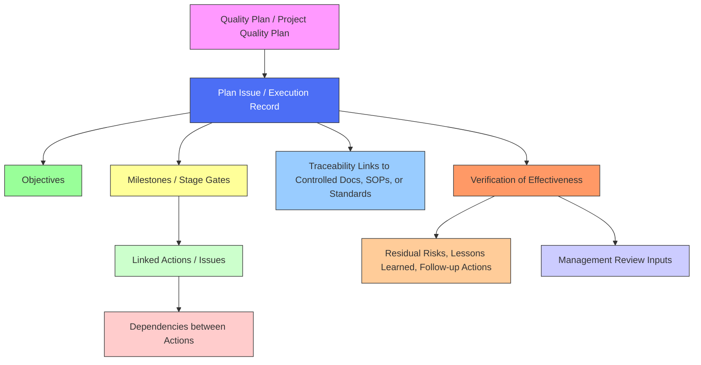

# **FLEY Planning Process**

The FLEY Planning Process defines how the organization plans, sequences, and verifies quality-related activities across projects, programs, and Management Review (MR) cycles. It uses a **Plan Issue type** in GitHub for Plans, Milestone Phases, and MR Cycles, supported by Milestones and Issue Dependencies. This ensures traceability, structured execution, and alignment with ISO 9001:2015.

---

## **1. Core Components**

### **Quality Plan (Controlled Document)**

A controlled document created only when required (regulated or high-impact work). It defines objectives, standards, roles, processes, and verification methods.

### **Plan Issue**

A GitHub Issue used for **every planning activity**, including:

* Projects / initiatives
* Milestone phases
* MR cycles

Each Plan Issue contains:

* Objectives
* Milestones
* Linked actions
* Dependencies (issue → issue)
* Traceability to controlled documents
* Verification of Effectiveness (VoE)

Plan Issues appear on Roadmaps and support sequencing.

---

## **2. Milestones and Milestone Phase Issues**

### **Milestones**

Used to group work into phases.
Milestones **cannot** have dependencies.

### **Milestone Phase Issues (Plan Issues used as phases)**

A Plan Issue that represents a milestone so it can:

* Participate in GitHub dependencies
* Sequence phases
* Block/unblock other Plans
* Roll up actions
* Trigger Management Review cycles

When a Milestone Phase Issue closes, the corresponding milestone may be completed (if configured).

**Hierarchy:**
**Actions → Milestone Phase Issues → Milestones → Plan Issues**

---

## **3. Actions**

Standard GitHub Issues connected to:

* A Plan Issue
* A Milestone
* Optionally, a Milestone Phase Issue (for sequencing)

Actions inherit traceability and sequencing from the Plan Issue they belong to.

---

## **4. Dependencies**

GitHub only supports **issue → issue**, so the sequencing model is:

* Plan Issue → Plan Issue
* Plan Issue → Milestone Phase Issue
* Milestone Phase Issue → Milestone Phase Issue
* Actions → Actions / Phase Issues

This builds a complete, GitHub-native sequencing structure across plans, phases, and MR cycles.

---

## **5. Management Review (MR) Cycle Plan Issue**

Each MR cycle is modeled as a **Plan Issue**.

MR cycles:

* Receive VoE outputs from Plans
* Carry forward residual risks and lessons learned
* Can be **automatically unblocked** when a triggering Milestone Phase Issue closes
  (e.g., “Audit-Ready QMS” → unblocks next MR cycle)

This creates predictable, automated MR rollovers.

---

## **6. Verification of Effectiveness (VoE)**

Performed at completion of a:

* Plan
* Milestone Phase
* MR cycle

VoE verifies that:

* Objectives were met
* Actions were completed or dispositioned
* Traceability remains intact
* Residual risks and lessons learned are documented

VoE results feed directly into MR cycles.

---

## **7. Process Overview**

### **1. Plan Creation**

1. Create a controlled Quality Plan if required.
2. Create a Plan Issue to manage execution.
3. Define objectives, milestones, and dependencies.
4. Add Milestone Phase Issues when sequencing is needed or when MR cycles depend on milestone completion.

### **2. Action Coordination**

* Link actions to the Plan Issue.
* Assign actions to milestones.
* Use Milestone Phase Issues to add dependency capabilities to milestones.

### **3. Monitoring & Traceability**

* Roadmaps show Plan sequencing via dependencies.
* Actions roll up into phases → milestones → Plans → MR cycles.
* Traceability links connect Plans to SOPs, standards, or controlled documents.

### **4. Management Review Integration**

* Each MR cycle is a Plan Issue.
* VoE outputs feed into MR cycle Plans.
* MR cycles can be blocked until a triggering Milestone Phase Issue closes.

### **5. Verification of Effectiveness**

* Confirms objectives and actions are completed.
* Identifies risks and lessons learned.
* Closes the loop between planning, execution, review, and improvement.

---

## **8. Benefits**

* One simplified issue type for Plans, Phases, and MR cycles
* Clean, GitHub-native execution using Issues, Milestones, Dependencies, Roadmaps
* Automatic sequencing of phases and MR cycles
* Consistent, auditable planning aligned with ISO 9001
* Clear hierarchical roll-up from actions → Plans → MR cycles
* Strong traceability and continuous improvement
