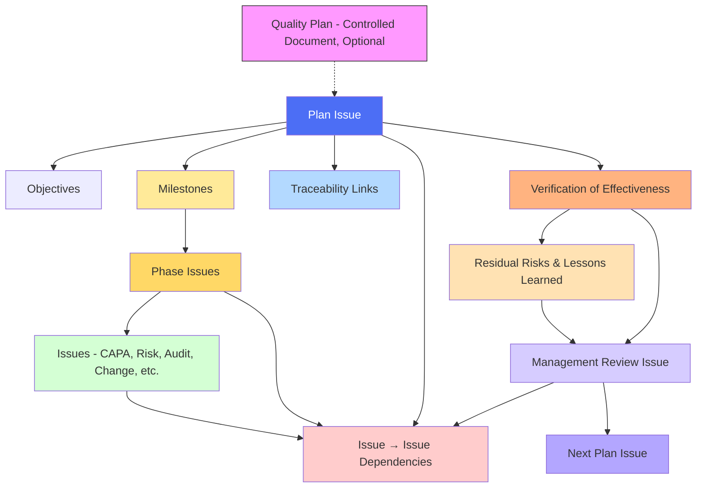

# **REF - FLEY QMS Overview**

## **Purpose**

FLEY operates its entire Quality Management System (QMS) inside GitHub using a unified digital workflow.
Two components work together:

1. **QMS Operations** — how Issues, Boards, Labels, and PRs run the day-to-day QMS.
2. **Planning Workflow** — how Planning Issues (Plans, Phases, MR cycles) govern sequencing, traceability, and Verification of Effectiveness (VoE).

Together, they provide a **single, auditable, ISO-aligned system** for planning, executing, and improving all quality-related work.


---

## **1. Core Artifacts**

### **Issues (Development / Operations)**

Execution-level work across the QMS: CAPA, Audit, Risk, Objective, Change Request, Nonconformance, etc. Issues hold evidence, traceability, and completion criteria.

### **Planning Issues**

The unifying artifact for **Plans, Phases, and Management Review (MR) cycles**.

Each Planning Issue contains:

* Objectives
* Milestones
* Linked Issues
* Dependencies (issue → issue)
* Traceability to controlled documents
* VoE results and roll-forward risks/opportunities

### **Plan Issues**

Planning Issues used for Quality Plans, PQPs, DCPs, improvement initiatives, or any structured planning activity.

### **Phase Issues**

Planning Issues representing phases/milestones **with sequencing capability** (dependency-enabled).

### **Management Review Issues**

Planning Issues used to run MR cycles, track required inputs, sequence readiness, and capture outputs and follow-up.

---

## **2. QMS Operations in GitHub**

### **Boards (QMS Workflow)**

```
Backlog → In Progress → In Test → Closed
```

* **Backlog:** New or proposed records
* **In Progress:** Investigation or execution
* **In Test:** Verification, review, approval, VoE
* **Closed:** Verified complete

### **Labels**

Used to classify QMS records (Risk, CAPA, Audit, Change Request, Opportunity, Objective, MR, etc.).
Labels drive dashboard views, reporting, and MR inputs.

### **Pull Requests**

Formal approvals for controlled documentation.
Linked to Change Requests.
Merging is the **approval event**.

### **Projects / Views**

Dashboards for Changes, Risks, Opportunities, Improvements, CAPA, Audits, MR items, and unlabeled work.

---

## **3. Planning Workflow**

FLEY uses GitHub Issues as the single planning backbone.
Dependencies create roadmap sequencing across Plans, Phases, and MR cycles.

### **Hierarchy**

**Issues → Phase Issues → Milestones → Plan Issues → MR Issues**

### **Milestones**

Group work; cannot hold dependencies.

### **Phase Issues**

Dependency-enabled phases that control sequencing, block/unblock Plans, and trigger MR cycles.

### **Plan Issues**

Define objectives, milestones, sequencing, and evidence expectations.
Used for Quality Plans, PQPs, DCPs, improvement initiatives, or any structured project.

### **Management Review (MR) Planning**

Each MR is a Planning Issue containing:

* Required §9.3 inputs
* Linked Plans and Phases
* VoE results
* Risks, opportunities, and follow-up Issues
* Dependency-based readiness (e.g., “Audit-Ready QMS” Phase Issue)

---

## **4. Sequencing (Dependencies)**

GitHub supports only **issue → issue**, enabling:

* Plan → Plan
* Plan → Phase
* Phase → Phase
* Issue → Issue or Phase

This builds a complete roadmap across projects, programs, and MR cycles.

Dependencies allow FLEY to:

* Define project and program order
* Enforce readiness gates
* Block MR cycles until prerequisites close
* Visualize work in GitHub Roadmaps

---

## **5. Verification of Effectiveness (VoE)**

VoE is performed at closure of:

* Plan Issues
* Phase Issues
* MR Issues

VoE confirms:

* Objectives were met
* Linked Issues are complete/dispositioned
* Evidence and traceability are complete
* Risks and lessons learned are captured

VoE outputs feed into the next MR cycle.

---

## **6. Continuous Improvement Loop**

1. **Plan** work using Planning Issues.
2. **Execute** work through standard Issues on the QMS Board.
3. **Verify** via VoE and PR-based approvals.
4. **Review** in Management Review Issues.
5. **Improve** via new Risks, Improvements, Changes, and Planning Issues.

This creates an ISO-aligned, fully traceable digital QMS with closed-loop improvement.
