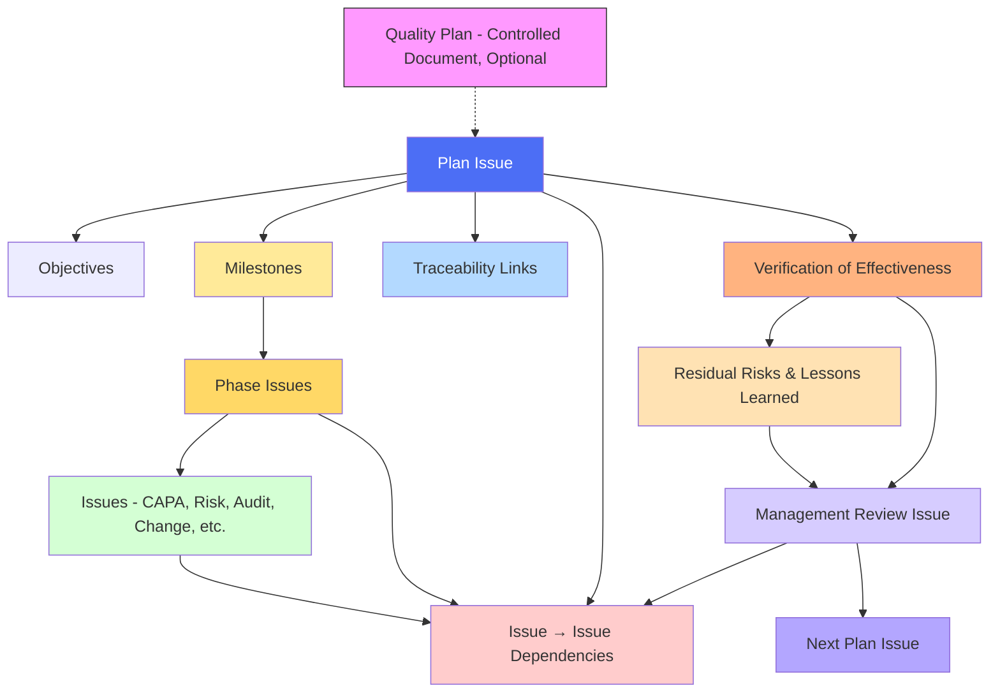

# **REF – FLEY QMS Quick Start**

## **Purpose**

This Quick Start introduces how the entire FLEY / Red Witch QMS operates inside **GitHub**.
It explains the core objects (Issues, Planning Issues, Documents), how they interact, and how the platform achieves full traceability, approvals, sequencing, and continuous improvement.

This is the entry point for understanding the system.

---

# **1. Platform Architecture**

The QMS runs entirely within GitHub using three pillars:

1. **Controlled Documents** - Stored in version control, changed only through Pull Requests.
2. **Issues** - Operational QMS records (Risk, CAPA, Audit, Change, NC, Objective, etc.).
3. **Planning Workflow** - Plan, Phase, and Management Review Issues linked by dependencies.

Together, they form a single, auditable workflow:


---

# **2. Repositories & Documents**

All controlled documents (Quality Manual, SOPs, WIs, Templates, Plans) live in Git and are approved through **Pull Requests**.

Key folders:

* `QMS/` - governance documents
* `SOPs/` - standard operating procedures
* `WIs/` - work instructions (tool specific)
* `Templates/` - standardized Markdown templates
* `Plans/` - Planning Issues and supporting artifacts
* `Compliance/` - standards mappings
* `Project-Docs/` - project-specific materials

PR merges, commit hashes, and tags form the **document control record** - no separate metadata files.

---

# **3. QMS Operations (Daily Work)**

## **Issue Types**

Operational records are captured as GitHub Issues:

* **Audit:** Internal/external audit records
* **CAPA:** Corrective and preventive actions
* **Change Request:** Proposed change for review and approval
* **Improvement:** General improvement actions
* **Nonconformance:** Record of non-fulfilment of a requirement
* **Objective:** Quality objectives and performance tracking
* **Opportunity:** Positive improvement opportunities
* **Risk:** Risk identification, evaluation, and mitigation

Issues contain evidence, links, acceptance criteria, and support dependencies.

## **Board Workflow**

```
Backlog → In Progress → In Test → Closed
```

* **Backlog:** New or proposed work
* **In Progress:** Execution / investigation
* **In Test:** Review, approval, validation
* **Closed:** Verified complete (VoE if required)

Labels classify Issues for reporting (Risk, CAPA, Audit, etc.).

---

# **4. Planning Workflow (How Work Is Sequenced)**

Planning Issues provide structure and sequencing:

### **Plan Issues**
Define objectives, milestones, required evidence, and dependencies.

### **Phase Issues**
Represent sequenced phases or readiness gates (dependency-enabled).

### **Management Review Issues**
Collect required inputs, check dependencies, review VoE results, and produce follow-up work.

### **Dependencies**
GitHub supports only issue → issue dependencies.
This is used to build roadmaps and readiness flows across:

* Plan → Plan
* Plan → Phase
* Phase → Phase
* Issue → Issue

The result is an integrated, cross-project roadmap.

---

# **5. Pull Requests (Change Control)**

All controlled documents and QMS configurations use PR-based approval:

1. Change Request Issue → Branch
2. Commit with traceable references
3. PR using template
4. Review + CODEOWNERS approvals
5. Finalize metadata (`status`, `effective` date)
6. Merge (approval event)
7. Tag revision

The [Pull-Test Walkthrough](https://github.com/Floating-Eye-Software/fley-qms/blob/main/WIs/GitHub/GitHub-Pull-Test.md) validates this exact process and is used to refine the Change Control WI.

---

# **6. Verification of Effectiveness (VoE)**

VoE is performed when Plans, Phases, or MR cycles close.

It checks:

* Objectives met
* Evidence complete
* Linked Issues dispositioned
* Lessons learned captured
* Residual risks rolled forward

VoE outputs feed into the next Plan and MR cycle.

---

# **7. Continuous Improvement Loop**

The system continuously improves itself:

1. **Plan** (Planning Issues)
2. **Execute** (Issues + Boards)
3. **Verify** (PR approval + VoE)
4. **Review** (MR Issue)
5. **Improve** (new Risks, Changes, Opportunities, Plans)

Because all work flows through GitHub, the QMS is:

* fully traceable
* self-sustaining
* always auditable

---

# **Quick Summary**

* GitHub = the QMS platform
* Issues run operations
* Plans/Phases/MR Issues run sequencing and readiness
* PRs run change control
* Dependencies build the roadmap
* VoE + MR close the loop
* Repositories store all controlled documents and evidence
