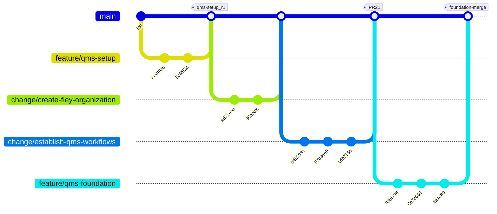

# **WI – GitHub Branching Model**

## **1. Purpose**

This Work Instruction defines the **branching model** for all QMS-controlled GitHub repositories operated by Floating Eye Software.

It establishes:

* required **branch types**
* required **naming conventions**
* required **branch lifecycle and merge pathways**
* expectations for **remote branch retention** and **traceability**

This WI **does not** define Pull Request approval rules, metadata handling, repository configuration, or tagging requirements.
Those topics are governed by:

* **WI – GitHub-Change-Control** (PR workflow, approvals, controlled changes)
* **WI – GitHub-Document-Control** (metadata, revision tags, file headers)
* **WI – GitHub-QMS-Setup** (branch protection, CODEOWNERS, repository baseline)

---

## **2. Scope**

### 2.1 Applies To

This WI applies to all:

* branches created within controlled QMS repositories
* contributors drafting or modifying QMS documentation, templates, or workflows
* software-configuration changes related to QMS processes

### 2.2 Exclusions

This WI does **not** cover:

* PR approval process → **see WI – GitHub-Change-Control**
* Effective-date handling and metadata → **see WI – GitHub-Document-Control**
* Repository protection rules (CODEOWNERS, settings) → **see WI – GitHub-QMS-Setup**
* Organizational or lifecycle procedures in migration activities → **see Repo-Migration-Plan**

---

## **3. References**

* SOP – Document Control
* SOP – Change Control
* WI – GitHub-Change-Control
* WI – GitHub-Document-Control
* WI – GitHub-QMS-Setup
* Repo-Migration-Plan
* ISO 9001:2015 §6.2, §7.5, §10.3

---

## **4. Responsibilities & Authorities**

| Role                      | Responsibilities                                                           | Authorities                                                  |
| ------------------------- | -------------------------------------------------------------------------- | ------------------------------------------------------------ |
| **Authors**               | Create branches, follow naming rules, keep scope aligned with branch type. | Create and update local/remote branches.                     |
| **Reviewers / Approvers** | Approve PRs per WI–GitHub-Change-Control.                                  | Approve merges into protected branches.                      |
| **Process Owners**        | Validate branch organization aligns with QMS objectives.                   | Approve objective-level branch consolidation.                |
| **Quality Manager / DCC** | Ensure compliance with naming and lifecycle rules.                         | Enforce branch retention; protect `main`/objective branches. |

---

## **5. Branch Types and Naming Rules**

This WI defines **three required branch types**.
Each exists to support the change-control workflow defined elsewhere.

### **5.1 Overview of Branch Types**

| Branch Type    | Purpose                                                          | Naming Pattern                       |
| -------------- | ---------------------------------------------------------------- | ------------------------------------ |
| **feature/**   | New documents or major foundational work                         | `feature/<short-name>`               |
| **change/**    | Single-issue updates or controlled document edits                | `change/<issue-number>-<short-desc>` |
| **objective/** | Multi-issue improvement efforts linked to a formal QMS objective | `objective/<objective-name>`         |

The `main` branch always represents the **approved controlled baseline**.

---

## **5.2 Branch Type Definitions**

### **5.2.1 `feature/*` — Foundational or New Document Development**

Use for:

* new controlled documents
* major new sections of the QMS
* foundational infrastructure (templates, folder structure, workflows)

Rules:

* May remain active for extended development periods.
* Multiple `change/*` branches may merge into a feature branch.
* When the work is complete, the feature branch merges into `main` via PR (approval rules are defined in WI–GitHub-Change-Control).

---

### **5.2.2 `change/*` — Issue-Specific Controlled Changes**

Use for:

* updates tied to a **single GitHub issue**
* small to medium document edits
* discrete corrections (hyperlinks, headers, small content adjustments)

Rules:

* Must be focused on a single issue or ticket.
* Must reference the issue in commit messages.
* May merge into:

  * a feature branch
  * an objective branch
  * directly into `main` (if in scope per WI–GitHub-Change-Control)

---

### **5.2.3 `objective/*` — Multi-Issue Objective Implementation**

Use for:

* management review outputs
* corrective or preventive action clusters
* larger strategic improvements (risk programs, training cycles)
* cross-branch coordinated change

Rules:

* Represents a **formal QMS Objective** (ISO 9001 §6.2).
* Contains multiple related `change/*` branches.
* Final merge into `main` uses a **single consolidated PR**, which serves as objective evidence.
* Additional metadata handling is governed by WI–GitHub-Document-Control.

---

## **6. Branch Lifecycle & Merge Pathways**

This WI defines **what may merge where**.
Approval rules are defined in **WI – GitHub-Change-Control**.

### **6.1 Allowed Merge Targets**

| Source Branch | Allowed Merge Targets                | Notes                                   |
| ------------- | ------------------------------------ | --------------------------------------- |
| `feature/*`   | → `main`                             | After foundational work is complete.    |
| `change/*`    | → `feature/*`, `objective/*`, `main` | Depends on change scope.                |
| `objective/*` | → `main`                             | Final consolidation of a QMS objective. |

All merges into protected branches must use PRs, per WI–GitHub-QMS-Setup.

---

## **7. Branch Retention Rules**

### **7.1 Local Branch Deletion**

Authors may freely delete local branches. This is not considered controlled information.

### **7.2 Remote Branch Retention**

Remote branches are treated as part of the **QMS record** (ISO 9001 §7.5.3).

Default rule:

> **Remote branches remain permanently**, unless retired by DCC after merge completion.

A remote branch may be deleted **only** when:

* it has been merged into its target (`main`, feature, or objective branch),
* the PR has been approved per WI–GitHub-Change-Control, and
* DCC or the Process Owner confirms retirement.

Rationale:

* enables reconstruction of change paths
* provides audit traceability
* supports VoE review and continuous improvement records

---

## **8. Repository Maintenance Expectations**

### **8.1 Branch Hygiene**

* Authors may prune local branches using:

  ```
  git fetch -p
  ```
* Remote branches remain unless formally retired.
* Branch names must remain readable and align with this WI.

### **8.2 Protected Branches**

This WI references but does **not redefine** protection rules.
Per **WI – GitHub-QMS-Setup**, the following branches are typically protected:

* `main`
* long-running `feature/*`
* long-running `objective/*`

---

## **9. Visual Model — Branching Flow**

This diagram demonstrates the intended structure and lifecycle.
It is illustrative only; actual branch names vary.



---

## **10. Records**

| Record                       | Owner         | Location   | Retention |
| ---------------------------- | ------------- | ---------- | --------- |
| Branch history and structure | GitHub        | Repository | Permanent |
| PR approvals                 | Approvers     | GitHub     | Permanent |
| Objective completion merges  | Process Owner | GitHub     | Permanent |
| Tags                         | DCC           | GitHub     | Permanent |
