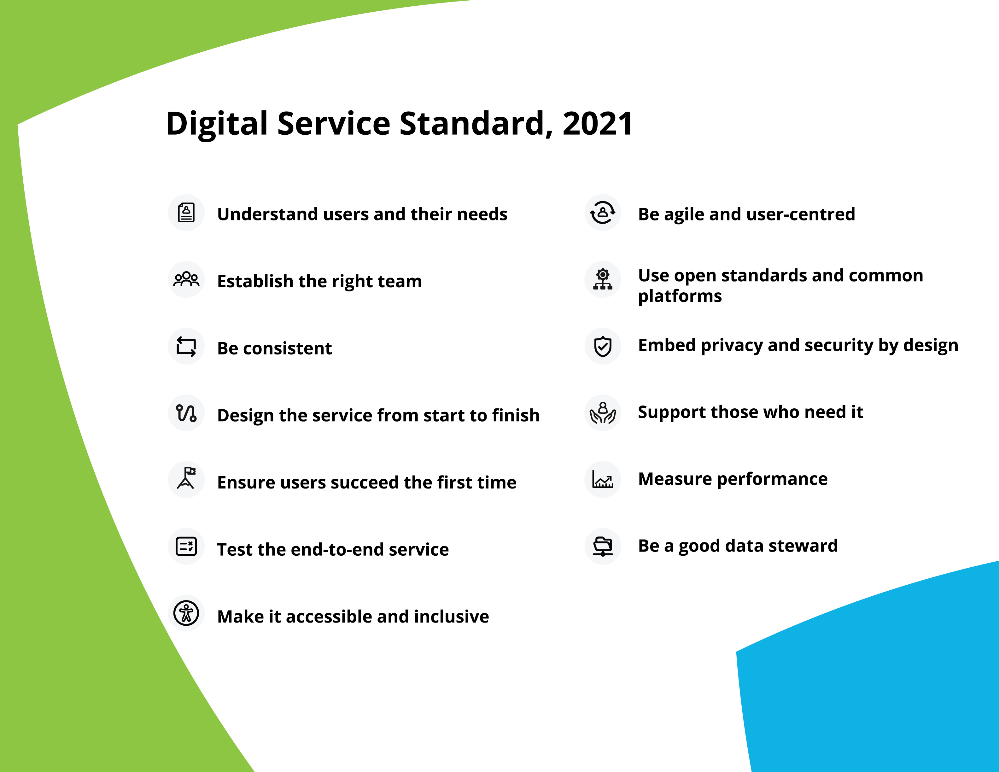

# **REF – Ontario Service Design Framework**

**Slug:** Ontario-Design-Framework  
**Revision:** r1  
**Effective Date:** [YYYY-MM-DD]  
**Related SOP:** Design-Control-SOP  
**Controlled Source:** https://github.com/mlehotay/redwitch/wiki/Ontario-Design-Framework  

---

The Ontario [Digital and Data Directive](https://www.ontario.ca/page/ontarios-digital-and-data-directive-2021), [Digital Service Standard](https://www.ontario.ca/page/digital-service-standard), and [Service Design Playbook](https://www.ontario.ca/page/service-design-playbook) provide a framework for the design and delivery of digital services and the proactive sharing of data.

Ontario’s service design journey follows design and release phases. Each phase is driven by user needs and prioritizes several points from the standard. Learn more about how to work in design and release phases in the [Service Design Playbook](https://www.ontario.ca/page/service-design-playbook).

### **1. Discovery phase**

Discovery helps define a service’s potential users and how their needs can be met.

In discovery:

* conduct user research
* decide who the primary user groups will be
* learn about the people who will use the service
* ask users what they want in a service
* check if there are existing or non-governmental services that meet user needs
* identify policies and other barriers that will make meeting user needs difficult
* document the findings

All services are different, but most projects need 4-8 weeks to for discovery.

#### **Deliverables**

* results of user research: user groups, personas, needs, expectations, etc
* results of market/regulatory/feasability research
* designate product manager
* establish [agile](https://www.ontario.ca/page/being-agile-ontario-public-service) workflow

### **2. Alpha phase**

While discovery is about research, alpha is about testing hypotheses and experimentation. The purpose of alpha is to determine how to meet the user needs that were identified in discovery. It’s an opportunity to quickly test many different approaches with users before building a service.

Alpha is fast-paced and may go in many unexpected directions before defining what the final solution could look like. Try new approaches to solving problems and test them quickly, so that potential issues can be found and fixed before investing too much time and money into one design.

In alpha:

* work directly with end users and stakeholders to co-create solutions
* build multiple prototypes of the service
* continuously test prototypes with users
* demonstrate that the service is technically and financially feasible
* estimate how much the service will cost
* identify existing processes or policies that will need to change to support the service

Alpha is a cyclical process of designing and testing potential solution options. Prototypes are built quickly, often together with users and stakeholders, and tested with real users. Feedback and testing results are used to improve the service. This process repeats itself until the prototype meets user needs and the first working version of the service is ready to be built. The first working version is called the minimum viable product. It will be built in the next phase, beta.

All services are different, but most teams will need 8-12 weeks to complete alpha.

#### **Deliverables**

* plan and conduct user testing
* prototypes and mockup designs from user testing
* journey map of user experience
* initial version of project plan containing:
    * technical approach / theory of operation
    * financial estimate for entire project
    * outline of plans for market surveillance, service, support, and updates

### **3. Beta phase**

Beta is when the service finally comes to life. The goal of beta is to build a real service that works well for a larger group of people. The prototypes that were developed and tested during alpha are used to build a minimum viable product in a live, user-facing environment.

Build quickly and in small segments, taking the time to confirm that each segment of the service is on the right track. Launching a public service is the ultimate usability test, as it collects real data and user feedback. Feedback is used to refine the service, adding and adjusting features until the service is complete.

In beta:

* make a prioritized list of the user stories that have already been researched
* build a minimum viable product that can be used by the public in a live environment
* continuously test the service with users to collect feedback and discover helpful insights
* test the design for accessibility and use assistive devices like screen readers
* measure the service against key performance indicators
* release updates to patch and improve the service
* resolve any remaining technical or process-related challenges

All services are different. Most teams need at least 3-4 months to complete beta.

#### **Deliverables**

* working version of service
* automated testing
* perform device validation on all platforms
* create privacy and security report
* create usability report
* include accessibility challenged user testers, leverage the [inclusive design cards](https://www.ontario.ca/page/inclusive-design-cards)
* include contact info / online help
* include [WCAG success criteria](https://www.w3.org/TR/WCAG21/) in UI testing
* use consistent branding, leverage the [Ontario Design System](https://designsystem.ontario.ca/)
* create plan for maintenance releases, outages, service monitoring
* create recovery plan for disasterous data loss
* create processes for updating server software as well as client devices
* create quality plan for frequent iterations including rollbacks and security fixes

### **4. Live phase**

Live begins when the service has reached a point of maturity and all of the main features in the backlog have been built. While most people understand the purpose of live, it’s not always given the attention and resources it deserves.

Without proper resources devoted to live, services become quickly outdated and fail to meet both the Digital Service Standard and user needs.

Continuous improvement is one of the core principles of service design and that’s what live is all about. The goal is to continuously monitor, research, test and iterate for as long as the service is active.

In live:

* monitor and track the status of the service and key performance indicators
* conduct ongoing user research and usability testing every three to four months
* continue building features from the backlog and releasing improvements to the service
* communicate and celebrate the successes of the service
* ensure the service continues to meet the Digital Service Standard

#### **Deliverables**

* continue service/maintenance after launch
* conduct usability testing periodically (after launch)
* support must be sustainable and free to access
* employ web analytics for product surveillance
* evaluate user complaints from all sources
* calculate performance metrics
* create and publish useful and open data

---

### **Principles**

The following principles are the basis for this system and are intended to provide guidance in interpreting and applying this framework.

* **Prioritization of user needs**: The needs of the user, determined through research and testing, are the first consideration in digital service delivery and the release of open data.
* **Transparency**: Government operates in a way that is easy for others to see what, why and how something is done.
* **Equitable access**: Access is equally available to all users.
* **Data informed**: The use of data is considered in decision-making.
* **Continuous improvement**: Government works in a way that demonstrates on-going, iterative improvement that is responsive to user need and supportive of the realization of benefit.

### **Digital Services**

Ministry and provincial agency digital services, whether internally built or procured, must be designed, delivered and implemented according to [Ontario’s Digital Service Standard](https://www.ontario.ca/page/digital-service-standard#section-1) (DSS).

Ministry and provincial agency digital services must be:

* designed in a user-centred manner, address user needs and be supportive of the users’ journey from end to end as determined through active user research
* continuously evaluated and improved in an iterative manner
* made with technology that is scalable, interoperable, secure, accessible and open
* designed to take advantage of reusable technology and data where available
* designed in an iterative manner by a multi-disciplinary team that is empowered to prioritize incremental work and make decisions in the open whenever possible and designed to make the most effective use of data

### **Digital Governance**

Governance is defined as the rules, systems and accountability structures that enable an organization to ensure that service development and delivery activities comply with all applicable regulations and legislation, optimize investments and risk, ensure the achievement of benefits and deliver on government mandate/priorities, while remaining mindful of user needs.

All ministry digital services and all ministry IT projects in excess of $1M (whether built internally or procured) must:

* Be evaluated against the DSS through digital and IT governance processes (for example, Digital First Assessments, Architecture Review Board, or other governance processes as established)

Assessment against the DSS must occur at each phase in the digital service design cycle.

### **Measurement**

Ministry and provincial agency digital services must demonstrate their contributions to broader service or policy outcomes and establish evaluation and analytics approaches to support continuous improvement.  

At a minimum, all digital services must: 

* identify the service or policy outcomes to which the digital service is contributing and how the digital service will be evaluated throughout service design and post launch
* use service analytics to understand user behaviour across channels
* define performance metrics for the service up-front, early in the design process
* analyze performance and identify actionable data insights as early as possible
* monitor and report on the realization and sustainment of benefits as applicable

### **Data**

Ministries and provincial agencies must be fully transparent about their data assets and the ways in which they are acquired and used.

Ministry and provincial agency data assets are open by default unless exempted from release in limited and specific circumstances as set out below:

* Data that is subject to statutory confidentiality requirements, (for example, exempt from publication under the Freedom of Information and Protection of Privacy Act, 1990, the Personal Health Information Protection Act, 2004, the Anti-Racism Act, 2017 and/or other statutes).

* Data that should not be disclosed for legal, security, confidentiality, privacy or commercial sensitivity reasons as identified by expert assessors (for example, legal counsel, ITS security or privacy professional) as described in the [Open Data Guidebook](https://www.ontario.ca/document/open-data-guidebook-guide-open-data-directive-2015) (2015).

Directors closest to the data must ensure the appropriate expert assessment occurs prior to the publication of data and approve its release.

Ministries and provincial agencies ensure exempted data remains secure and is managed responsibly.

Open data must be accurate, timely, openly accessible, interpretable, coherent, de-identified, primary and released in accordance with the principles in the [International Open Data Charter](https://opendatacharter.net/principles/).

Ministries are required to consult and comply with the Open Data Guidebook. Provincial agencies should use the Open Data Guidebook as an example of best practices to adopt.

### **Open Data Publication**

All open data must be released in an open format.

Open data must be released at no charge to the user (for example, for-profit business, researcher or interested party etc.) and under the [Open Government Licence](https://www.ontario.ca/page/open-government-licence-ontario) – Ontario (See Appendix) and/or a similar open licence in consultation with users and on the advice of counsel.

No data assets released as open data are to be deleted or removed from public access except where it was published in error.

Ministry open data is to be published to the [Ontario Data Catalogue](https://data.ontario.ca/) in the language in which it was collected. The dataset title, description, and all accompanying supporting information must be available simultaneously in both English and French.

### **Applicable Standards**

* Ontario’s Digital and Data Directive, 2021
* Governance and Management of IT Directive, 2021
* Governance and Management of Information Assets Directive, 2021
* Simpler, Faster, Better Services Act, 2019
* Archives and Recordkeeping Act, 2006
* Freedom of Information and Protection of Privacy Act, 1990
* Personal Health Information Protection Act, 2004
* Anti-Racism Act, 2017
* French Language Services Act, 1990
* Accessibility for Ontarians with Disabilities Act, 2005
